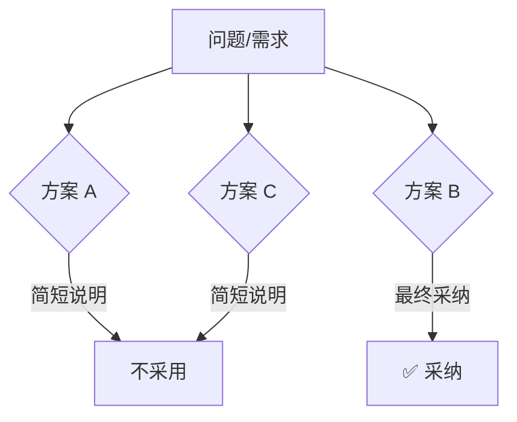

# Specs 目录规范

本文档定义了 `specs/` 目录下设计文档和实施计划的编写规范。

---

## 目录结构

```
specs/
├── AGENTS.md                              ← 本文档
├── constitution/                          ← 决策记录：重大设计决策、已达成的共识
│   └── YY-MM-DD-<topic>.md
├── research/                              ← 调研文档：问题分析、技术评估、架构演进设想
│   └── YYYY-MM-DD-<topic>-research.md
├── active/                                ← 执行阶段：正在实施中的计划（新 spec 默认放这里）
│   └── <topic>-plan.md                    （包含背景+设计+分阶段实施计划）
└── archive/                               ← 归档阶段：已完成或废弃的文档
    ├── completed-feature-plan.md
    └── abandoned-approach-plan.md
```

**说明**：每个 `-plan.md` 文档包含完整的背景分析、设计思路和分阶段实施计划，不再区分单独的 design 文档。Agent 每次会话从 `active/` 读取当前工作上下文。`-research.md` 文档为调研性质，记录问题分析、技术评估或架构演进探索，不包含分阶段实施任务。

---

## Constitution（决策记录）

### 定位

Constitution 是项目级"宪法"——记录经过讨论后**已经确定的设计决策、体验目标和结构边界**。它首先回答的是"我们决定了什么"，然后才补充"为什么这样决定"。它不是实施计划，也不是长篇方案辩论稿。

### 与 research / active / archive 的区别

| 维度         | Constitution                                                   | Research                                              | active / archive                       |
| ------------ | -------------------------------------------------------------- | ----------------------------------------------------- | -------------------------------------- |
| **内容性质** | 决策性记录：产品/UX/UI/技术上已经定下来的方向、约束和边界       | 调研性记录：问题分析、方案评估、架构演进探索           | 实施性记录：怎么做、分几步、改哪些文件 |
| **生命周期** | 长期有效，直到被新决策显式推翻或更新                           | 长期有效，直到被新调研替代或转为正式决策               | 随实施进度流转，完成后归档             |
| **粒度**     | 偏向"what + constraints"，可以包含结构设计，但不展开实施任务    | 偏向"why + how it could be"，探讨可行方向而非落地任务  | 偏向"how"，包含具体阶段与落地动作      |
| **读者**     | 任何需要快速建立统一心智的人，包括未来的 agent、开发者和产品同学 | Agent 和开发者，用于理解问题全貌和方案探索             | Agent 和开发者，用于指导当前工作       |

### 什么时候写 Constitution

以下场景应产出 Constitution 记录：

1. **调研后达成共识**——经过多方案对比讨论，最终确定了设计方向（如多租户方案选型）
2. **跨 spec 的全局决策**——影响多个 spec 的架构约束、交互原则或对象模型
3. **用户明确表达的产品偏好**——如"第一版不做实时同步，只做复制/派生"
4. **需要为后续实现者固定边界**——避免 agent 或开发者在后续实现中反复重开同一类讨论

### 什么时候不需要写

- 纯粹的代码实现细节
- 单一 spec 内部的临时设计选择（留在 spec 自身即可）
- 尚在探索阶段、未形成明确结论的调研（放在 `research/` 中）

### 文件命名与格式

```
specs/constitution/YYYY-MM-DD-<topic>.md
```

文档模板：

```markdown
# [决策标题]

## 元数据

| 字段         | 值                                    |
| ------------ | ------------------------------------- |
| **决策日期** | YYYY-MM-DD                            |
| **关联 spec** | 受影响的 spec 文档（如有）            |

## 决策摘要

用 3-6 行先说明：

- 这次决策要解决什么问题
- 最终决定是什么
- 主要影响哪些产品面或模块

## 背景

2-4 段。从项目当前状态出发，解释：
- 当前系统是什么、能做什么
- 遇到了什么问题或需求
- 为什么需要做这个决策
- 如果不做会怎样

目标：让没有参与讨论的读者也能理解问题的全貌和紧迫性。
不要假设读者已经读过调研文档或 spec。

## 用户叙事

用具体的人物和操作流程描述决策落地后的预期用户体验。
覆盖决策涉及的核心功能点，让产品侧和技术侧读者快速理解"我们到底在做什么"。

示例结构：
- 用 2-3 个虚构用户（Alice、Bob、Carol）
- 按操作步骤描述完整流程
- 每个步骤对应一个核心功能点
- 简洁但覆盖完整，不需要 UI 细节

## 最终决策

先给出 1-3 句话总结，再用条目化方式展开：

- **产品决策**：对象模型、主流程、默认行为
- **UX / UI 决策**：交互心智、布局约束、页面结构、状态表达
- **技术决策**：核心模型边界、数据流、前后端职责划分、运行时约束

目标是让后续实现者不必通读论证过程，也能直接知道应该按什么方向实现。

## 设计约束与不变量

列出后续实现默认不能违背的规则。典型内容包括：

- 哪些对象是一等对象，哪些是派生对象
- 哪些交互不能退化回旧模式
- 哪些技术分层不能混用
- 哪些约束在当前阶段必须保持成立

## 技术设计与结构边界

这里记录稳定的结构设计，而不是实施步骤。技术设计至少应该覆盖会影响实现边界的核心内容，而不只是抽象原则。推荐按下面几个方面组织：

- **数据库表 / 持久化设计**：如果决策涉及新增或修改数据库结构，至少说明会新增/修改哪些表、核心字段、表间关系、约束，以及是否需要迁移
- **核心模型关系**：对象之间如何关联，哪些是一等模型，哪些是派生模型
- **关键数据流**：从用户操作到后端落库、任务触发、状态回传的大致链路
- **后端实现思路**：大致会新增或修改哪些 API、service、callback 或后台任务；不需要展开到逐文件任务，但要让读者知道后端准备怎么接
- **前端对接思路**：前端会消费哪些新字段或接口，主要影响哪些页面、面板、交互入口或状态展示
- **接口边界**：前后端职责如何切分，哪些信息在接口层暴露，哪些只在内部维护
- **持久状态、运行时、权限或资源边界**：如果涉及执行环境、权限、资源占用、会话恢复等，也应该明确写出边界

如果需要图示，优先用结构图或关系图帮助读者快速建立心智。

## 备选方案简述

这一节可以保留，但应该简洁。重点不是展开大段"为什么不是 X"，而是避免未来重复争论：

- 看过哪些备选方案
- 为什么最终没选
- 每个方案用 1-3 句话说明即可

如果某个被排除方案会在特定场景下重新变得合理，可以顺手写明触发条件。

## 可视化补充（可选）



## 约束与前提

- <这个决策成立的前提条件>
- <如果前提变化，这个决策可能需要重新审视>

## 历史变更

| 日期       | 变更内容 | 原因         |
| ---------- | -------- | ------------ |
| YYYY-MM-DD | 初次记录 | 调研后达成共识 |
```

### 关键原则

1. **决策优先，论证次之**——先让读者看懂最后决定，再补必要理由，不要把正文写成长篇方案辩论
2. **用户叙事必须保留**——用具体人物和流程把抽象决策落到真实体验上，这是连接产品和技术的核心部分
3. **背景先行，但要克制**——背景要足够让陌生读者理解问题，不要把调研过程全文搬进来
4. **重点写清 UX / UI / 技术边界**——后续实现最需要的是稳定心智和约束，而不是冗长的正反论证
5. **技术设计要能指导实现者落地**——如果涉及数据库、API 或前端对接，至少要写出表设计变化、接口变化和对接思路，避免只留下抽象口号
6. **备选方案要短**——保留"为什么没选"的摘要即可，作用是防止重复争论，不是成为正文主角
7. **记录不变量**——明确哪些对象、流程、分层和交互不能在后续实现中被悄悄改回去
8. **保持更新**——当新的调研或需求导致决策变更时，在"历史变更"中记录演进，而不是直接删除旧内容

### 参考示例

- [2026-04-15-workspace-team-multitenancy.md](constitution/2026-04-15-workspace-team-multitenancy.md) — 多租户基础设计决策（含背景、用户叙事、5 个关键论点）
- [2026-04-15-workspace-agent.execution.md](constitution/2026-04-15-workspace-agent-execution.md) — spec 拆分与 agent 执行设计决策

---

## Research（调研文档）

### 定位

Research 是项目级"笔记本"——记录尚在探索阶段的**问题分析、技术评估、性能调查和架构演进设想**。它回答的是"我们发现/探索了什么"，而不是"我们决定了什么"或"我们要做什么"。当调研产出明确结论并准备落地时，应转化为 Constitution（决策）或 active/ 中的 spec（实施计划）。

### 什么时候写 Research

以下场景应产出 Research 文档：

1. **问题深度分析**——生产环境出现复杂问题，需要系统性梳理根因、影响范围和修复策略
2. **技术方案评估**——面对多种可选技术方案，需要记录对比过程和各自的优劣分析
3. **架构演进设想**——非短期的架构优化方向、技术债务清理路线图，当前不急于实施但值得记录
4. **性能调查**——对系统性能瓶颈的剖析、基准测试结果和优化方向探索
5. **可行性预研**——某个功能点在技术上的可行性验证，尚不足以形成实施计划

### 什么时候不需要写

- 已经有明确结论、可以直接形成决策的（写 Constitution）
- 已经可以拆分为具体实施任务的（直接写 active/ spec）
- 一次性就能回答的简单技术问题（直接在对话中解决）

### 文件命名与格式

```
specs/research/YYYY-MM-DD-<topic>-research.md
```

- 使用日期前缀，方便按时间线追溯调研历程
- 统一使用 `-research.md` 后缀，便于区分计划文档

### 文档模板

```markdown
# [调研标题]

## 元数据

| 字段         | 值                                                                                   |
| ------------ | ------------------------------------------------------------------------------------ |
| **创建日期** | YYYY-MM-DD                                                                           |
| **研究领域** | problem-analysis / architecture-evolution / technology-evaluation / performance-investigation / feasibility |
| **关联 spec** | 受影响或相关的 spec 文档（如有）                                                    |
| **状态**     | open / concluded / superseded                                                        |

## 课题描述

2-4 段。说明：

- 要调研的问题或探索的方向是什么
- 为什么需要调研（遇到了什么现象、收到了什么需求、发现了什么风险）
- 期望调研产出什么（根因定位、方案推荐、可行性判断等）

## 调研方法

简述采用的调研方式，例如：

- 代码审查 / 静态分析
- 性能剖析 / 基准测试
- 方案对比 / PoC 验证
- 文献调研 / 业界实践参考

## 发现与分析

### 发现 1: [标题]

详细描述发现的内容，可以包含：

- 代码路径分析
- 数据指标
- 架构关系
- 复现步骤

### 发现 2: [标题]

（同上格式，按需增加）

## 结论与建议

（可选）基于调研给出的建议、可行方向或后续行动。

如果调研结论明确到可以形成决策或实施计划，注明：

- → 转化为 Constitution: [决策标题]
- → 转化为 Spec: `<topic>-plan.md`

## 未解问题

（可选）调研中发现的仍需进一步探索的问题。

## 附录

（可选）补充材料：原始数据、详细日志、参考链接等。
```

### 关键原则

1. **重过程，轻结论**——调研的价值在于分析过程本身，即使最终没有明确结论也有记录价值
2. **保持客观**——记录事实和发现，区分"观测到"和"推测"，避免过早下结论
3. **指向行动**——当调研产出明确结论时，及时转化为决策或实施计划，不要让调研文档变成永久居留所
4. **可追溯**——记录调研方法、数据来源和分析路径，方便未来验证或补充
5. **适度深度**——足够详细让后续读者理解分析过程，但不必面面俱到，聚焦关键发现

---

## 新建 Spec 文档规范

### 文档命名

| 命名格式                | 用途                                   | 示例                                    |
| ----------------------- | -------------------------------------- | --------------------------------------- |
| `<uuid><topic>-plan.md` | 实施计划（包含背景、设计、分阶段任务） | `01-local-mount-simplification-plan.md` |

- **统一使用 `-plan.md` 后缀**，文档内部自然包含背景、设计、实施等所有内容。
- 其中 <uuid> 是从 `00` 开始自增的数字，你需要关注 specs 目录下已有的 spec，然后选择下一个 `uuid`，方便用户根据顺序查看

### 文档模板

```markdown
# [标题]

## 元数据

| 字段             | 值                                                      |
| ---------------- | ------------------------------------------------------- |
| **创建日期**     | YYYY-MM-DD                                              |
| **预期改动范围** | [影响的服务/模块]                                       |
| **改动类型**     | feat / fix / refactor / docs / perf / test              |
| **优先级**       | P0 / P1 / P2 / P3                                       |
| **状态**         | in-progress / review / completed / cancelled            |

## 实施阶段

- [ ] Phase 0: [阶段名称]
- [ ] Phase 1: [阶段名称]
- [ ] Phase 2: [阶段名称]
- ...

---

## 背景

### 问题陈述

描述当前存在的问题或需要改进的地方。

### 目标

明确本次改动要达到的目标。

### 关键洞察

（可选）重要的技术洞察或架构决策说明。

---

## Phase 0: [阶段名称]

### 目标

简述本阶段的目标。

### 任务清单

#### 0.1 [任务名称]

**描述：** 任务的详细说明

**涉及文件：**

- `path/to/file1.py` - 修改内容概述
- `path/to/file2.ts` - 修改内容概述

**验收标准：**

- [ ] 标准1
- [ ] 标准2

---

## Phase 1: [阶段名称]

（同上格式）

---

## 风险与缓解

| 风险 | 影响 | 缓解措施 |
| ---- | ---- | -------- |
| ...  | ...  | ...      |

---

## 总结

（可选）简要总结整个改动的设计思路和预期效果。
```

---

## 任务完成规范

### 完成标记

当任务完成时：

```markdown
- [x] Phase 1: 清理云端挂载代码 (2026-03-26)
```

### 文档流转

文档在三个目录之间流转，反映其生命周期状态：

| 状态            | 位置             | 说明                                     |
| --------------- | ---------------- | ---------------------------------------- |
| **in-progress** | `specs/active/`  | 正在实施，Agent 每次会话从这里读取上下文 |
| **review**      | `specs/active/`  | 实施完成，等待审核验收                   |
| **completed**   | `specs/archive/` | 已完成并验收通过                         |
| **cancelled**   | `specs/archive/` | 废弃，说明废弃原因                       |

Research 文档有独立的生命周期：

| 状态            | 位置               | 说明                                   |
| --------------- | ------------------ | -------------------------------------- |
| **open**        | `specs/research/`  | 调研进行中                             |
| **concluded**   | `specs/research/`  | 调研已完成，结论已记录                 |
| **superseded**  | `specs/archive/`   | 被更新的调研替代                       |

### 归档文档标记

在归档文档顶部添加：

```markdown
> **状态**：✅ 已完成 (2026-03-26)
> **归档原因**：功能已实现并测试通过
```

或

```markdown
> **状态**：❌ 已废弃 (2026-03-26)
> **废弃原因**：采用新的技术方案
```

---

## 改动类型说明

| 类型         | 说明               | 示例                        |
| ------------ | ------------------ | --------------------------- |
| **feat**     | 新功能             | 添加本地文件系统挂载        |
| **fix**      | 问题修复           | 修复容器创建时的路径验证    |
| **refactor** | 重构（不改变功能） | 简化挂载 provider 架构      |
| **perf**     | 性能优化           | 减少 Docker volume 挂载开销 |
| **docs**     | 文档变更           | 更新 API 文档               |
| **test**     | 测试相关           | 添加集成测试                |

---

## 编写指南

### Phase 划分原则

1. **可独立执行**：每个 Phase 应该可以独立完成并验证
2. **依赖关系清晰**：后续 Phase 依赖前面的 Phase
3. **粒度适中**：单个 Phase 不应太大（建议 1-3 天完成）
4. **验收标准明确**：每个 Phase 有清晰的完成条件

### 任务编写规范

1. **具体可执行**：任务描述足够具体，开发者知道要做什么
2. **文件路径明确**：列出所有涉及的文件
3. **验收标准可测试**：可以明确判断任务是否完成

### 背景信息要求

1. **问题导向**：说明要解决什么问题
2. **技术背景**：提供必要的技术上下文
3. **关键洞察**：突出重要的设计决策

---

## 文档生命周期

### 流转路径

```
新建 spec:
specs/active/<topic>-plan.md          (in-progress → review)
     ↓ 验收通过 / 废弃
specs/archive/<topic>-plan.md         (completed / cancelled)
     ↓ 有长期参考价值？
     ↓        ↓
    是        否
     ↓        ↓
  改写后     保留在 archive/
  移入 docs/  供决策追溯

调研文档:
specs/research/<topic>-research.md    (open → concluded)
     ↓ 被新调研替代
specs/archive/<topic>-research.md     (superseded)

调研 → 实施:
specs/research/<topic>-research.md    (concluded)
     ↓ 结论明确，准备落地
specs/active/<topic>-plan.md          (in-progress)
```

### 各目录职责

| 目录         | 职责                                         | Agent 行为                                  |
| ------------ | -------------------------------------------- | ------------------------------------------- |
| `active/`    | 唯一的执行入口，Agent 会话启动时读取         | 读取上下文、更新进度、完成 Phase 标记       |
| `research/`  | 调研与探索，记录问题分析和架构演进设想       | 参考背景，遇到类似问题时查阅已有调研        |
| `archive/`   | 已完成/废弃/被替代文档的档案馆               | 遇到类似问题时查阅历史决策和调研            |

### 垃圾回收

`archive/` 不会无限膨胀。定期（建议每月）审视：

- 清除已无参考价值的废弃文档
- 将仍有价值的 completed 文档改写后提升为项目 `docs/`
- 保留的 archive 文档应能在决策追溯中被引用

### 查阅归档文档

- 归档文档包含原始设计思路和决策过程
- 可以作为类似问题的参考，避免重复踩坑
- 了解技术决策的演进历史

---

## 示例参考

### 良好的 Phase 划分

```markdown
## 实施阶段

- [ ] Phase 0: 分析与设计确认
- [ ] Phase 1: 清理云端挂载代码
- [ ] Phase 2: 修复本地路径验证
- [ ] Phase 3: 更新配置与文档
- [ ] Phase 4: 测试验证
```

### 良好的任务描述

```markdown
#### 1.1 删除 BridgeLiveMountProvider 类

**文件：** `executor_manager/app/services/local_mount_service.py`

**操作：**

- 删除 `BridgeLiveMountProvider` 类定义
- 删除相关的方法和常量
- 更新 `LocalMountService.__init__` 移除对它的引用

**验收标准：**

- [ ] `BridgeLiveMountProvider` 类不存在
- [ ] 代码可以正常启动（import 无错误）
- [ ] 相关单元测试已更新或删除
```

---

## 常见问题

### Q: 什么时候应该写 research 而不是直接写 spec？

**A:** 以下情况应先写 research：问题根因不明需要深入分析、多种技术方案需要对比评估、架构优化方向需要探索但暂不实施。当调研产出明确结论且可以拆分为具体实施任务时，再从 research 转为 active/ 中的 spec。

### Q: Phase 任务可以并行执行吗？

**A:** 如果 Phase 之间没有依赖关系，可以并行。在文档中注明可并行。

### Q: 如何处理需求的变更？

**A:** 在文档顶部添加"变更记录"部分：

```markdown
## 变更记录

| 日期       | 变更内容     | 原因     |
| ---------- | ------------ | -------- |
| 2026-03-26 | 移除 Phase 3 | 需求变更 |
```

---

## 整理 Spec 指令

当用户说"帮我整理 spec"时，Agent 按照以下规范执行 specs 目录的整理工作。

### 触发条件

用户主动说"帮我整理 spec"、"整理一下 spec"、"spec 归档"等意图明确的指令时触发。

### 完成判断规则

一个 spec 被视为"已完成"需**同时满足**以下两个条件：

1. **元数据状态字段**为 `completed` 或 `review`
2. **所有 Phase 和子任务**都已标记为 `[x]`

### 执行流程（先计划后执行）

Agent **必须**先扫描所有目录并生成整理计划，列出具体操作项，等用户确认后再执行。禁止直接移动或删除文件。

#### Step 1: 扫描与分类

扫描 `active/`、`research/`、`archive/` 三个目录，将每个文档归入以下类别：

| 类别 | 判定条件 |
|------|---------|
| **可归档** | 状态字段 = `completed`/`review` **且** 所有任务已 `[x]` |
| **存疑** | 仅满足一个条件（状态达标但任务未全完成，或任务全完成但状态字段不匹配） |
| **未完成** | 两个条件均不满足 |
| **过期** | 创建/修改距今超过 2 周且无实质进展 |

Research 文档分类：

| 类别 | 判定条件 |
|------|---------|
| **可归档** | 状态为 `superseded`，或 `concluded` 且结论已转化为 spec/constitution |
| **活跃** | 状态为 `open` 或 `concluded` 且仍有参考价值 |

#### Step 2: 汇总决策

扫描完成后，Agent 使用**交互式提问工具**（如 Claude Code 的 `AskUserQuestion`、Copilot CLI 的提问功能等）一次性收集用户对所有待定项的决策。

**优先使用提问工具**——相比在文本中列出问题等待用户手动回复，提问工具能提供结构化选项、减少来回沟通、避免遗漏。

提问时应将同一类决策合并为一个多选问题（最多 4 个选项），按以下分组：

1. **存疑项处理**（multiSelect）：每个存疑 spec 作为一个选项，说明存疑原因和建议操作
2. **过期项处理**（multiSelect）：每个过期 spec 作为一个选项，提供"废弃/保留/更新"选项
3. **归档确认**（singleSelect）：列出所有可归档的 spec，确认是否执行归档
4. **合并确认**（singleSelect）：如达到合并阈值，确认是否执行合并

**提问工具不可用时**（如纯文本聊天环境），退回到文本报告模式，将所有待定项以结构化表格形式列出，等待用户回复。

#### Step 3: 等待用户确认后执行

用户通过提问工具或文本回复确认后，按计划执行文件操作，完成后汇报结果。

### 扫描报告格式（提问工具可用时）

当使用提问工具时，扫描报告可以精简为摘要形式（提问工具会承载详细信息）：

```
## Specs 扫描摘要

- active/: 3 个文件 — 2 个可归档，1 个存疑
- research/: 2 个文件 — 1 个活跃，1 个可归档
- archive/: 5 个文件
- 过期提醒: 1 个

以下问题需要你的确认 ↓（通过提问工具收集）
```

### 扫描报告格式（纯文本模式）

当提问工具不可用时，输出完整报告：

```
## Specs 整理报告

### 📂 active/（3 个文件）
| 编号 | 文件名 | 状态 | 任务完成度 | 判定 | 备注 |
|------|--------|------|-----------|------|------|
| 00   | ...    | completed | 6/6  | ✅ 可归档 | |
| 04   | ...    | completed | 0/5  | ⚠️ 存疑   | 状态达标但验收 checkbox 未打勾 |
| 05   | ...    | in-progress | 11/11 | ⚠️ 存疑   | 任务全完成，但状态字段非 completed |

### 📂 research/（2 个文件）
| 日期 | 文件名 | 状态 | 判定 | 备注 |
|------|--------|------|------|------|
| 2026-04-20 | ... | concluded | ✅ 可归档 | 结论已转化为 spec 14 |
| 2026-04-28 | ... | open | 🔄 活跃 | |

### 整理计划
1. 归档：active/00, active/01, research/2026-04-20-xxx
2. 合并：未达阈值
3. 存疑项需确认：04, 05
4. 过期项：无

请回复你的决策，或提出调整。
```

### 归档操作

将已完成的 spec 从 `active/` 或 `research/` 移入 `archive/`：

1. 移动文件到 `archive/`
2. 在文件顶部添加归档标记（参见"归档文档标记"章节）

### 合并操作

当 `archive/` 中的 completed 文件数量 ≥ **5 个**时触发合并。

**触发条件：**
- 按 spec 编号顺序，连续的 completed spec 达到 5 个或以上即触发
- cancelled 文档不计入连续数量

**命名规则：**
```
archive/Merged-XX-XX.md
```
其中 XX-XX 表示合并的 spec 编号范围，如 `Merged-01-05.md` 表示合并了 01 到 05 号 spec。

**合并文档格式：**

```markdown
# Merged Spec 摘要 (01-05)

> 本文档合并了以下 5 个已完成的 spec，保留摘要和关键决策以供追溯。
> 合并日期：YYYY-MM-DD

---

## 01 - [spec 标题]

- **改动类型：** feat / fix / refactor / ...
- **完成日期：** YYYY-MM-DD
- **摘要：** 1-2 句话概括做了什么
- **关键决策：** 提取该 spec 中的重要设计决策和约束（如有）

---

## 02 - [spec 标题]

- **改动类型：** ...
- **完成日期：** YYYY-MM-DD
- **摘要：** ...
- **关键决策：** ...

---

（以此类推）

---

## 已归档的原始文件

以下文件已合并归档，不再单独保留：

- `archive/01-xxx-plan.md`
- `archive/02-xxx-plan.md`
- `archive/03-xxx-plan.md`
- `archive/04-xxx-plan.md`
- `archive/05-xxx-plan.md`
```

合并完成后，删除被合并的原始 spec 文件。

### 过期提醒

对 `active/` 和 `research/` 中满足以下条件的文档发出提醒：

- **创建日期**距当前超过 2 周
- **最后修改日期**距当前超过 2 周
- **无实质进展**（任务 checkbox 无变化或 research 状态仍为 open）

处理方式（优先使用提问工具，每个过期文档作为一个选项）：
- **废弃**：移入 archive 并标记 cancelled / superseded
- **保留**：继续开发，不做处理
- **更新**：刷新内容，重置时间戳

### 废弃文档处理

当 `archive/` 中存在 cancelled 文档时，通过提问工具询问用户（每个 cancelled spec 作为一个选项）：

- **保留**：有参考价值（记录了重要的排除方案或失败原因）
- **删除**：无参考价值

用户确认后执行。

### 整理后汇报

执行完毕后，输出整理结果摘要：

```
## 整理完成

- 归档：2 个 spec 移入 archive/
- 合并：5 个 spec 合并为 Merged-01-05.md
- 清理：删除 1 个无价值的 cancelled spec
- 过期提醒：1 个文档需要关注

当前目录状态：
- active/: 1 个文件
- research/: 2 个文件
- archive/: 1 个 merged 文件 + 0 个独立归档
```
