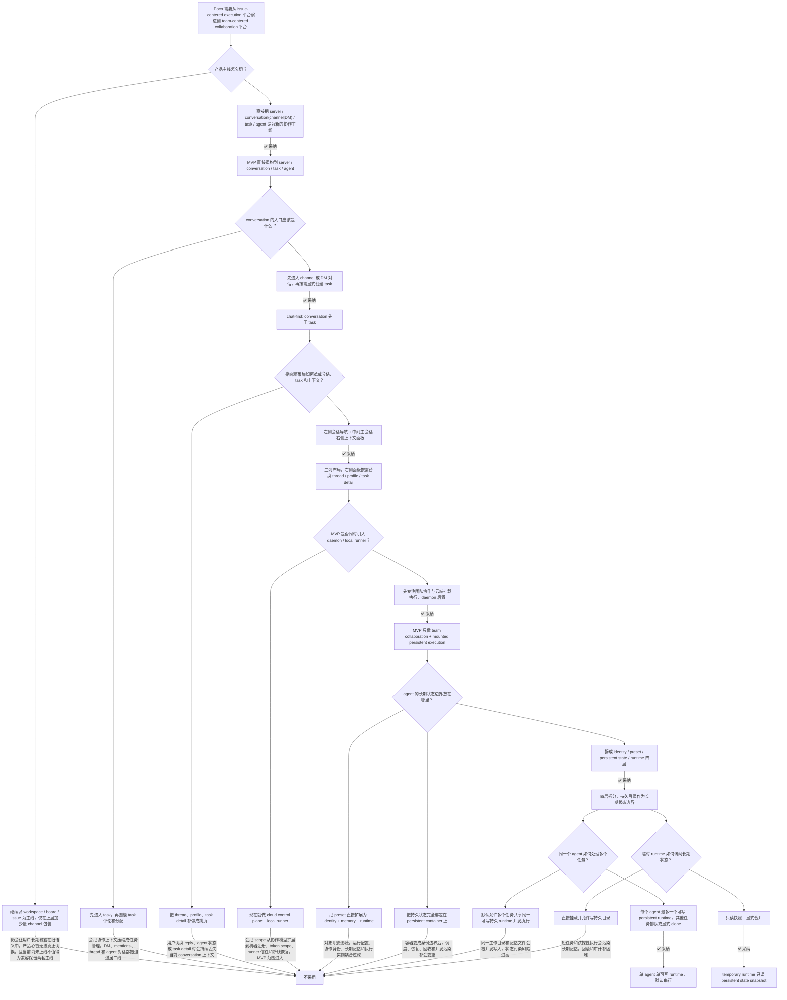

# 面向团队协作的 server / channel / agent 持久运行决策

## 元数据

| 字段 | 值 |
| --- | --- |
| **决策日期** | 2026-05-04 |
| **关联 spec** | `08-server-channel-foundation-plan.md`、`09-channel-task-collaboration-plan.md`、`10-agent-persistent-state-runtime-plan.md`、`11-chat-first-channel-conversation-plan.md` |

---

## 背景

Poco 当前已经完成了一轮围绕 `workspace / board / issue / preset / agent assignment` 的团队协作与执行建模。到目前为止，系统的核心优势仍然是执行层：容器沙箱、会话链路、工具调用、callback 持久化、前端执行回放。这套能力让 Poco 很适合做“围绕 task 跑 agent”的平台。

但这轮产品讨论暴露出一个新的重心变化：用户希望把团队协作本身提升为第一视角，不再只是“在 issue 上挂一个 agent”，而是更接近 `server -> conversation -> task -> agent` 的协作模型。这里的 `conversation` 不是 task 的别名，而是先于 task 存在的会话空间，至少包括 `channel` 和 `direct message`。换句话说，产品主舞台不再只是 project / issue / session，而是团队频道和私信中的消息、thread、mentions、任务派生、状态流转和 agent 作为队友的协作存在。

如果继续沿用上一轮“先保持 workspace 主干，再慢慢往上包一层 channel/task”的思路，确实最稳，但它默认前提是“我们已经上线，向后兼容成本高”。而当前阶段是敏捷开发、尚未上线，用户明确表达了一个新的偏好：**第一版不需要为了向后兼容增加冗余封装和保护层，可以直接朝 server / channel 语义重构。**

与此同时，另一个设计问题也被同时抬升出来：如果 agent 真正成为频道和私信里的长期成员，它不能只是一段 prompt 配置，也不能完全依赖短期 session。它需要一套持久状态边界来保存身份记忆、工作上下文和任务进度。但这个持久边界也不能简单等价为“永远开着的容器”，否则并发、恢复和状态污染问题会很快失控。

因此，本次决策要同时回答两个问题：

1. Poco 的团队协作主线，是否直接切换到 `server / conversation(channel|DM) / task / agent`？
2. task 在这个主线里，到底是“进入会话的入口”，还是“从会话中派生出来的对象”？
3. 如果 agent 需要长期存在，它的身份、记忆、持久状态、执行 runtime 应该如何切分？

## 用户叙事

下面这段用户叙事描述的是这次决策落地后的 MVP 体验，不涉及实现细节，只说明用户侧会看到什么。

**Alice 创建了一个团队 Server，准备让人和 agent 在同一个协作空间里持续对话和推进任务。**

1. **创建协作空间**：Alice 创建一个名为 `Poco Core` 的 server。这个 server 下有 `#general`、`#backend`、`#frontend` 等频道。团队成员加入 server 后，可以根据自己所在的工作流进入不同频道讨论。

2. **先进入会话，再开始协作**：Alice 打开 `#backend` 频道，先看到的是聊天会话，而不是任务列表。左侧是 channels 和 direct messages，中间是当前会话的消息流与 composer，右侧是可切换的上下文面板。

3. **在会话中 @ 人类和 agent**：Alice 在消息里 `@backend-specialist` 和 `@Bob`，直接在频道里分配调研和实现分工。每条消息左侧有头像、作者、时间和 mentions，高亮后的 mentions 是显式协作信号。

4. **按需把对话显式创建为 task**：当 Alice 认为某条消息已经形成明确工作项时，她在 composer 或消息上下文动作里选择 `As Task / Create as task`。系统才显式创建一个四阶段 task，并把它和来源消息、来源 thread 关联起来。这个 task 会出现在该 conversation 的 `Tasks` tab 中，状态固定为 `todo -> in_progress -> in_review -> done`。

5. **在右侧查看 thread 和上下文**：Alice 点击一条消息下方的 replies 数量，右侧面板切换成该 thread，而不是跳走当前页面。她仍然保留左侧会话导航和中间主消息流，只是右侧变成 replies 互动区。

6. **直接和 agent 建立私信**：除了频道协作，Alice 也可以打开和 `@backend-specialist` 的 direct message，单独查看它的 profile、activity、runtime 状态，并向它发起不适合在公开频道中讨论的协作请求。

7. **agent 在持久状态上工作**：`@backend-specialist` 在自己的持久状态目录里保存 `MEMORY.md`、关键知识、当前上下文和任务状态。它进入自己的持久化容器中工作，逐步更新这些长期状态文件，并在频道或 DM 中持续同步进展。

8. **避免并发污染**：此时 Alice 又在另一个频道给 `@backend-specialist` 派生了第二个正式 task。系统不会让同一个 agent 的持久容器同时处理两个正式任务，而是把第二个任务排队，或者提示改派给其他 agent。这样可以避免多个任务同时污染同一份长期记忆和工作目录。

## 决策结论

> Poco 的团队协作主线在 MVP 阶段直接切换到 `server / conversation(channel|DM) / task / agent`。其中，`channel` 和 `direct message` 是一等会话对象，`task` 不是进入会话的前置入口，而是从会话中显式派生出来的协作对象。桌面端默认采用左侧会话导航、中间主会话、右侧上下文面板的三列布局。Agent 采用“身份、运行配置、持久状态、执行 runtime”四层拆分：每个 agent identity 拥有一份持久状态目录和至多一个可写的持久 runtime；临时 runtime 只能读取持久状态快照，不能直接修改长期状态文件。

---

## 决策路径



## 关键论点

### 为什么 MVP 可以直接重构到 server / conversation / task / agent，而不是继续保留旧主线

如果系统已经上线，保持 `workspace / board / issue` 作为稳定主干、再在上面逐步叠加 `channel / task` 的语义，是更稳的工程路线。但当前用户明确说明：这是敏捷开发阶段，且系统尚未上线，不需要为了向后兼容增加冗余的封装和保护逻辑。

在这个前提下，继续保留双主线反而会带来额外负担：

- **产品心智不清晰**：用户看到的是新概念，开发者维护的却还是旧概念，容易长期两套词汇并存。
- **实现复杂度更高**：每做一个页面和接口，都要同时考虑旧入口和新入口。
- **技术债形成更快**：临时兼容层一旦进入 MVP，很容易因为“先这样用着”而长期遗留。

因此，这次不再把“兼容旧主线”当成默认目标，而是接受直接重构产品语义：`server / conversation(channel|DM) / task / agent` 成为新的协作第一视角。

### 为什么 conversation 必须先于 task，task 必须从对话中显式派生

如果用户进入频道后先看到的是 task 页面，那么系统虽然名义上用了 `channel`，但实际心智仍然是旧的 work-item-first 模式。这样会直接损失几种新的核心协作能力：

- **频道内直接对话**：用户和 agent 的协作会被迫绕路到 task detail，而不是先通过消息建立上下文。
- **direct message**：如果 task 是主入口，DM 很容易退化成“只是 task 的另一个展示方式”，而不是一等会话对象。
- **mentions 与 thread**：@ 人类、@ agent、reply、子话题这些会话能力会被迫依附 task，而不是自然存在于 conversation 中。

因此，这次明确采用 chat-first 主线：

- 用户先进入 channel 或 DM
- 会话里先发生消息、mentions、reply 和协作分工
- 当一条消息形成明确工作项时，再通过显式动作 `create as task`

这能确保 task 保留来源消息、来源会话和 thread 关系，也让 task 真正成为 conversation 中派生出来的对象。

### 为什么 DM 必须是一等对象，而不是频道或 task 的副产物

一旦 agent 被提升为长期成员，用户就不只会在公开频道里和它协作，还会希望：

- 单独向 agent 交代私有上下文
- 查看某个 agent 的 activity 和 runtime 状态
- 让用户和用户之间直接同步，不污染公开频道

如果 DM 不是一等对象，这些交互都只能被迫塞进频道或 task detail，结果就是：

- agent profile 和状态被绑定在 task 上
- 用户无法把“会话协作”和“工作项追踪”区分开
- 私密上下文没有合理承载层

因此，DM 必须和 channel 一样，都是 conversation 类型，只是参与者和可见性不同。

### 为什么桌面端必须采用三列布局，而不是把 thread、profile、task detail 做成跳页

用户给出的参考交互已经说明了一个关键事实：协作不是“看完一条消息就跳去另一个页面”，而是持续在同一会话里切换上下文。

三列布局的价值在于：

- **左列**：稳定承载 channels 和 direct messages，用户不会丢失会话切换能力
- **中列**：持续保留主消息流或 task tab，保证当前 conversation 的主体上下文不丢
- **右列**：按需替换成 thread、agent profile、agent activity 或 task detail

如果把 reply、profile 或 task detail 做成跳页，会立即带来两个问题：

- 用户频繁失去当前 conversation 上下文
- thread、profile、task detail 彼此之间无法自然切换

因此，右侧面板不是“附加说明区”，而是会话内上下文切换的核心承载层。

### 为什么 daemon / local runner 不进入当前 MVP

Slock daemon 的核心价值是把云端协作面和本地执行面连接起来，这条路线很有吸引力，也很值得后续借鉴。但如果把它纳入本次 MVP，系统 scope 会立刻扩大到另一个层面：

- runner 机器注册与信任模型
- 本地 token scope 与吊销策略
- 本地 runtime 托管与 crash 恢复
- 多机绑定、断线重试、任务回收
- 本地目录隔离与审计

这些问题和“团队协作主线切换”不是同一层复杂度。把两者放在一个 MVP 里，会让团队同时处理产品重构、执行边界重构和部署形态重构，风险过高。

因此，本次明确把 daemon / local runner 后置。当前 MVP 只处理：

- server / channel / task / agent 的协作模型
- 基于云端挂载和持久容器的执行模型

后续如果协作面跑通，再单独评估 `poco-runner` 这条路线。

### 为什么 agent 必须拆成 identity / preset / persistent state / runtime 四层

用户现在希望 preset 不只是 prompt 模板，而是能承载 agent 的记忆、工作状态和长期行为。如果直接把所有能力塞进 preset，会导致单个对象同时承担四种职责：

- 对外可见的协作身份
- 对内可复用的运行配置
- 长期记忆和工作状态
- 当前执行实例

这种设计的问题不是“不优雅”，而是会很快带来具体工程困难：

- **身份和配置难分离**：同一个 agent 想换模型或 skill 集，是否意味着“换了一个人”？
- **长期状态难迁移**：记忆是跟身份走、跟配置走，还是跟容器走？
- **运行时约束难表达**：一个 agent 的当前容器、暂停状态、队列情况，本质上不是 preset 属性。

更稳妥的边界是：

- `AgentIdentity`：协作层身份，负责名字、头像、描述、所属 server/channel 权限。
- `RuntimePreset`：运行配置，负责 prompt、skills、MCP、模型、工具权限、容器策略。
- `PersistentState`：长期状态目录，负责 `MEMORY.md`、知识笔记、当前上下文、任务状态。
- `RuntimeContainer`：执行实例，负责承载一次持续执行。

这样，身份、配置、状态、运行实例可以各自演进，而不会在一个对象里互相绑死。

### 为什么长期状态的第一边界必须是 agent-owned persistent state，而不是 persistent container

Persistent container 对执行很重要，但它不是最好的长期状态所有者。原因在于：

- **容器是执行载体，不是知识载体**：容器更适合承载进程、依赖、临时文件和当前任务工作区。
- **容器生命周期不够稳定**：重建、迁移、回收、镜像升级都会让“把记忆绑在容器上”变得昂贵。
- **并发污染更难控制**：一旦容器既是执行实例又是长期状态边界，多个任务共享它时很容易互相覆盖状态。

因此，这次明确长期状态应首先落在 agent-owned 目录，例如：

```text
agents/<agent_id>/
  profile.json
  MEMORY.md
  notes/
    key-knowledge.md
    active-context.md
  state/
    task-state.json
    channel-state.json
  artifacts/
```

容器负责挂载和使用这份目录，而不是拥有这份目录。

### 为什么每个 agent identity 在任一时刻最多只能有一个可写的 persistent runtime

如果用户希望 agent 在多个频道中长期工作，并持续维护自己的记忆、进度和上下文，那么默认无限并行会立刻引入状态污染：

- 两个任务同时写 `MEMORY.md`
- 两个频道同时修改 `active-context`
- 同一个工作目录被并发改动
- 队列状态和当前任务状态互相覆盖

这类问题不是靠“约定大家别乱写”能解决的。产品和系统必须从一开始就明确单写者模型：

- 一个 `AgentIdentity` 在任一时刻最多一个**可写** persistent runtime
- 新任务默认进入该 agent 队列，或要求改派
- 如果未来需要并行，必须走显式 clone / worker runtime 路线，而不是共享可写状态

这个约束会让早期调度看起来更保守，但换来的回报是：长期状态可解释、可恢复、可审计。

### 为什么 temporary runtime 必须只能读取 persistent state snapshot，而不能直接写长期状态

用户已经明确希望临时性容器不能修改持久化相关文件。这个方向是对的，但仅仅写成“不能修改文件”还不够，必须进一步明确交互模型，否则实现时很容易出现“虽然逻辑上不该写，但实际上还是共享挂载了目录”的情况。

更稳的设计是：

1. temporary runtime 启动时读取 persistent state 的快照；
2. persistent state 对 temporary runtime 是只读的；
3. temporary runtime 的输出如果想进入长期状态，必须经过显式 merge / promote，或人工确认。

这样可以把短任务、验证任务和试探性修改限制在自己的边界里，避免它们自动污染长期知识和任务进度。

### 为什么看板在新主线里保留为 conversation 下 task 的视图，而不是继续作为独立领域对象

当前团队已经接受一个事实：协作主线要转向频道和任务，而不是继续围绕 issue 页面组织工作。这并不意味着看板价值消失，而是它的定位发生变化。

看板的价值在于：

- 按状态查看任务堆积
- 快速拖动和推进工作流
- 在固定的四阶段中观察团队负载

这些价值完全可以保留，但它不再需要单独承担“组织上下文”的角色。新的组织上下文由 conversation 提供；在 channel 里，看板成为 `Tasks` tab 下 task 的一种视图即可。这与用户已经接受的 `todo -> in_progress -> in_review -> done` 模型是完全一致的，也不妨碍 DM 或 thread 中的消息显式派生出 task。

## 约束与前提

- 这份决策以“系统尚未上线、可以接受直接语义重构”为前提。如果未来已有大量生产数据或外部 API 依赖，迁移策略需要重新评估。
- 当前 MVP 不包含 daemon / local runner、本地机器注册、runner token scope、多机调度和断线恢复。
- 当前 MVP 默认 conversation-first：channel 和 direct message 是一等会话对象；task 必须通过显式动作从 conversation 中派生，而不是作为进入会话的前置入口。
- 当前 MVP 的桌面端交互以三列布局为基线：左侧会话导航、中间主会话、右侧上下文面板。reply / thread 打开后替换右侧面板，而不是跳转出当前 conversation。
- 当前 MVP 允许使用云端挂载和持久容器承载长期 agent runtime，但长期状态所有权仍属于 agent-owned persistent state。
- 当前 MVP 默认一个 agent identity 只处理一个 active writable runtime；并发 clone / worker 机制不在本轮范围内。
- temporary runtime 只能读取 persistent state snapshot，不直接修改长期状态文件；任何长期状态写入都必须回到 persistent runtime 或显式 merge 流程。
- `RuntimePreset` 仍然是执行配置来源，但不再承担完整 identity / memory / runtime 语义。

## 历史变更

| 日期 | 变更内容 | 原因 |
| --- | --- | --- |
| 2026-05-04 | 初次记录 | 团队协作主线从 workspace / board / issue 切换到 server / channel / task / agent，并明确 agent 持久状态与 runtime 边界 |
| 2026-05-04 | 补充 chat-first 会话主线、DM 一等对象、三列布局与 create-as-task 规则 | 明确频道先是对话空间，task 从 conversation 中显式派生，agent 也需要以 channel / DM 成员身份被看见与交互 |
