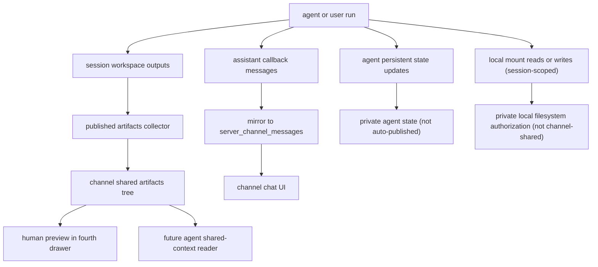
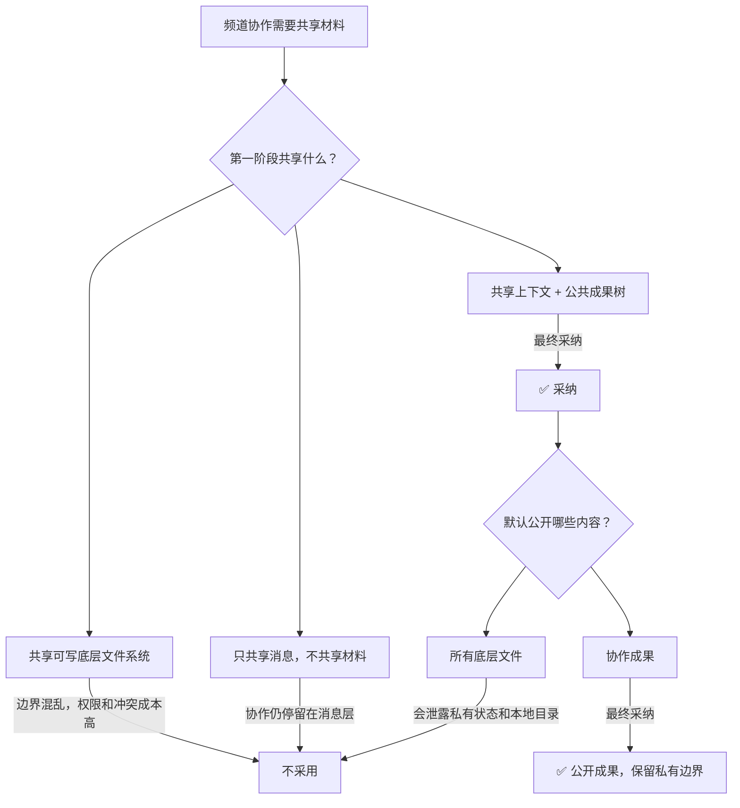

# 频道共享上下文与公共成果树决策

## 元数据

| 字段 | 值 |
| --- | --- |
| **决策日期** | 2026-05-05 |
| **关联 spec** | `11-chat-first-channel-conversation-plan.md`、`12-server-conversation-follow-up-plan.md`、`13-server-conversation-user-profiles-plan.md`、`14-channel-shared-context-and-published-artifacts-plan.md` |

## 决策摘要

- 这次决策要解决的是：频道里的用户和 agent 如何围绕同一批材料协作，而不把底层文件系统边界混在一起。
- 最终决定是：第一阶段先共享 `channel-level context` 和 `published artifacts`，不引入频道共享可写文件系统。
- 所有面向协作的新材料默认自动公开到频道公共成果树，并按 agent 分组展示，供同频道人类和 agent 读取与预览。
- `agent persistent state`、`temporary snapshot` 和 `local_mount` 本体不自动进入频道公共树，继续保持各自边界。
- 当前实现还额外补齐了频道消息镜像、thread reply 目标继承和 owner-only 持久化文件预览，让“共享上下文”和“共享成果”不仅存在于 trigger prompt，也真实体现在频道 UI 中。
- 主要影响的模块包括：频道会话 UI、右侧第四抽屉、agent 触发上下文组装、session 导出结果的公开规则，以及频道级文件读取授权。

## 背景

Poco 当前已经具备 `server / channel / direct message / task / agent` 的 chat-first 协作骨架。人类和 agent 可以共享消息、thread、mention 和 task 状态流转，agent 也已经有了明确的长期状态边界：`persistent runtime` 可写自己的持久状态目录，`temporary runtime` 只能读取状态快照。

但频道协作目前仍主要停留在消息层。agent 在一次运行中产出的计划、文档、清单或其他文件，通常仍留在自己的 session workspace、导出快照或私有状态边界中。其他人即使知道“某个 agent 已经生成了一份材料”，也没有稳定的频道入口去查看、预览和继续复用它。

最直接的补法是“让整个频道共享一个文件系统”，甚至把本地挂载目录直接变成频道公共盘。但现有系统至少存在三类不同职责的边界：`session workspace`、`agent persistent state`、`local_mount`。它们的权限模型、安全边界和生命周期都不同。如果在当前阶段直接把这些边界合并成频道共享可写盘，会立即引入权限扩散、并发写冲突、私有状态泄露以及用户本地目录暴露问题。

因此，当前更需要的是把“频道共享可见的语境”和“频道共享可读的成果”先做实，而不是仓促引入一个可写底层公共盘。如果不先做这个决策，后续实现很容易在“共享上下文”“公开成果”“共享本地目录”和“共享 agent 私有状态”之间不断滑动，最终把系统边界做乱。

## 用户叙事

**Alice 在 `#backend` 频道里同时和 Bob、`@api-specialist`、`@test-specialist` 协作。**

1. Alice 在频道里发起一个问题。两个 agent 都能读到同一段消息历史、当前 thread、相关 task 和频道共享说明，因此它们对“当前在解决什么问题”有共同理解。
2. `@api-specialist` 在一次运行中生成了 `rate-limit-plan.md` 和一份接口检查清单。系统把这些新材料自动出现在频道最右侧的公共成果树里，并清楚标记归属为 `api-specialist`。
3. Alice 和 Bob 可以直接在右侧第四抽屉里查看文件树、展开分组、预览文件内容，不需要再通过聊天消息反复贴文件正文。
4. 之后 Alice 又 `@test-specialist`。它被触发时，不需要别人手动复制 `rate-limit-plan.md` 的内容给它，而是可以把公共成果树里的这份文件作为已共享材料读取，继续补测试方案。
5. `@api-specialist` 自己的 `MEMORY.md`、长期 notes 和状态文件不会自动显示在公共成果树里。频道共享的是协作成果，不是 agent 私有记忆。
6. 如果某次运行使用了本地挂载目录，agent 可以在那次 session 中访问它，但这个本地真实目录不会因为“在频道里协作”就自动变成整个频道都能读写的公共盘。只有进入公共成果树的材料才对频道公开。

## 最终决策

Poco 在频道协作的下一阶段先引入“两层共享”而不是“共享可写文件系统”。第一层共享 `channel-level context`，第二层共享 `published artifacts tree`。频道成员和频道内 agent 先围绕共同语境和公共成果协作，后续再单独评估是否真的需要共享底层可写文件系统。

- **产品决策**：
  - 频道内新产生的协作材料默认自动公开。
  - 公开后的材料进入频道公共成果树，按来源 agent 分组展示。
  - 同频道的人类和 agent 都可以读取这些公开材料。
  - 频道第一阶段不提供“整个频道共享一个可写工作目录”的能力。
  - 频道里被 agent 触发出来的执行 session 仍属于频道上下文，不再额外出现在全局左侧“任务清单”中。
  - thread reply 默认延续当前 thread 的 agent 目标，用户不必重复显式输入 `@handle`。
- **UX / UI 决策**：
  - 在聊天频道最右侧新增第四抽屉，用来展示公共成果树和文件预览。
  - 公共成果树必须按 agent 分组，而不是平铺文件列表。
  - 用户需要能在树中看见来源归属、分组边界和文件预览。
  - 前三列 chat-first 主结构不改变，第四抽屉只承载共享成果相关上下文。
  - 在 `thread` 抽屉中，系统会提示当前回复默认指向的 agent
  - 在 `colleagues` / `profile` 视图里，agent 头像优先使用 preset visual，并用状态圆点 + 文本表达 runtime 状态。
  - server owner 可以在 colleague profile 中直接浏览 agent 持久化目录中的公开可读文件。
- **技术决策**：
  - `published artifacts` 成为新的稳定共享边界。
  - `agent persistent state`、`temporary snapshot` 和 `local_mount` 本体不自动进入共享边界。
  - 其他 agent 后续被触发时，可把频道公共成果树视为只读协作输入面。
  - 频道成员读取公开材料的授权基于 `channel membership`，而不是原 session owner 身份。
  - 频道中的 agent 回复会在 callback 完成后镜像回 `server_channel_messages`，使频道消息流和 agent session 结果保持同一可见上下文。

## 设计约束与不变量

- `published artifacts` 是频道共享对象；`session workspace`、`persistent state`、`temporary snapshot`、`local_mount` 不是。
- 频道第一阶段不引入共享可写底层文件系统。
- 自动公开默认开启，但自动公开的对象必须是“协作成果”，不是“所有底层文件”。
- `MEMORY.md`、`notes/`、`state/`、其他私有状态材料默认不能进入频道公共树。
- `local_mount` 继续是 session-scoped 授权，不因为频道成员关系而传播。
- 第四抽屉展示公共成果树时必须保留来源归属，不能退化成无分组文件列表。
- 后续 agent 读取共享材料时，只能读取公共成果树中的已公开材料，不能越权回读别人的私有状态或本地目录。
- 频道中的 thread reply 默认继承 thread 目标 agent，这个语义应当强于“用户必须再次手写 mention”。
- `colleagues/profile` 中展示的 agent 持久化文件浏览能力是 owner-only，可读、可预览，但不改变其私有边界。
- 频道中的 agent session 属于 server-scoped execution，不应再进入通用 task history 列表。

## 技术设计与结构边界

这里记录稳定的结构边界，不展开实施步骤。

### 核心边界

- `session workspace`
  - 单次执行工作区。
  - 可被导出、归档、生成公开成果。
  - 默认不直接作为频道共享盘。
- `agent persistent state`
  - agent 私有长期状态。
  - 包括 `MEMORY.md`、长期 notes、状态文件等。
  - 默认不公开，不自动进入频道公共树。
- `temporary snapshot`
  - 临时运行读取的状态快照。
  - 用于执行输入，不是频道共享材料。
- `local_mount`
  - 当前 session 的真实本地目录授权入口。
  - 仍然保持 session 级授权，不提升为频道公共存储。
- `published artifacts`
  - 频道共享成果边界。
  - 面向同频道成员和同频道 agent 可读。
  - 默认自动收集新的协作材料，并提供树形浏览与预览。
- `server_channel_messages`
  - 频道消息本身是一等协作对象。
  - 用户消息、system/task 消息和 agent callback 镜像消息都在这里汇聚。
  - 频道 UI 最终读取的是这一层，而不是直接读取 `agent_messages`。

### 关键数据流

### 前后端职责划分

- **后端职责**：
  - 判断哪些材料属于可公开协作成果。
  - 维护频道公共成果索引与读取授权。
  - 在后续 agent 触发时，把公共成果树内容组装为只读共享上下文。
  - 在 callback 处理阶段，将完成态 assistant 消息镜像回频道消息流。
  - 为 server owner 暴露 agent 持久化目录的只读文件树与文件流接口。
- **前端职责**：
  - 在第四抽屉中按 agent 分组展示公共成果树。
  - 提供文件预览与来源可视化。
  - 不自行推断私有文件是否应公开，一切以后端返回的公共成果集合为准。
  - 在 thread reply 交互中延续目标 agent，上屏的是提示语义，不是新的独立路由规则。
  - 在 server 相关列表中把 server-scoped session 从全局 task history 中剔除，避免一个频道事件在多个导航语义里重复出现。

### 当前实现状态

截至 2026 年 5 月 6 日，和本决策直接相关的实现状态如下。

- **已落地**
  - channel trigger prompt 已包含最近消息、公开 artifacts，以及频道内可协作的人类/agent handles。
  - agent callback 的完成态 assistant 消息会镜像为频道中的 `system` 消息，保留 `actor_label`、`agent_handle` 等上下文。
  - `thread` 抽屉会从 thread 历史中推断默认目标 agent，并在发送 reply 时自动补齐对应 `@handle`。
  - `colleagues/profile` 中的 agent 头像已改为优先复用 preset visual。
  - server owner 已可在 profile 页中通过复用文件树和文档预览组件浏览 agent 持久化目录。
  - server-scoped session 已从左侧全局 task history 中排除。
- **部分落地 / 仍待完善**
  - channel chat 与 agent runtime status 的同步仍主要依赖 polling / refresh 思路，尚未完全达到普通聊天那种增量更新体验。
  - thread reply 目前仍是“前端补全 mention”的过渡实现，尚未升级成真正后端建模的 thread-bound routing。

## 备选方案简述

- **方案 A：直接让频道共享一个可写文件系统**
  - 没选，因为会把 session workspace、persistent state 和 local mount 混成一个边界，权限和并发冲突成本过高。
- **方案 B：继续只共享消息，不共享任何材料**
  - 没选，因为协作仍会停留在自然语言层，agent 之间无法稳定复用共同成果。
- **方案 C：所有公共材料都必须手动发布**
  - 没选，因为操作负担太高，真实使用中容易遗漏，协作链路会断。

如果未来需要多 agent 同写一份共享目录，或需要把频道协作推进到 repo/workspace 级别，那时再单独评估 `channel workspace` 是否成为新的可写共享边界，而不是在当前阶段直接复用现有三种底层边界。

## 可视化补充

## 约束与前提

- 当前阶段的目标是先做“共享上下文 + 公共成果树”，不是共享可写文件系统。
- 频道公共成果树默认对同频道成员和同频道 agent 可读。
- 自动公开能力建立在“可识别协作成果”之上，而不是对整个底层目录做无差别暴露。
- 第四抽屉是当前阶段唯一新增的频道共享材料主入口。
- 频道消息镜像当前只在 assistant 完成态发生，避免把不稳定中间话术直接刷进频道主消息流。
- owner-only 的持久化文件浏览建立在当前单机 `tmp_workspace/agents/<id>` 布局之上；如果未来 workspace 根路径迁移，需要同步调整浏览器接口。
- 如果未来部署形态、权限模型或 runner 模型发生变化，这份决策需要重新审视。

## 历史变更

| 日期 | 变更内容 | 原因 |
| --- | --- | --- |
| 2026-05-05 | 初次记录 | 针对频道共享材料与文件边界达成共识 |
| 2026-05-05 | 重写为标准 Constitution 结构 | 对齐 `specs/AGENTS.md` 模板，收紧为决策记录 |
| 2026-05-06 | 补充当前已落地实现状态与边界 | 使文档反映真实代码，而不只停留在方向性决策 |
