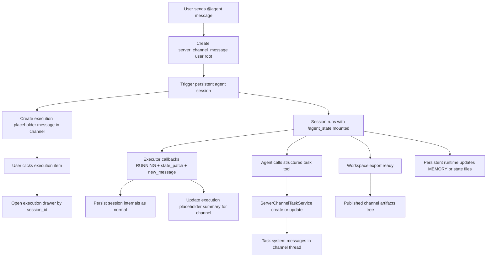
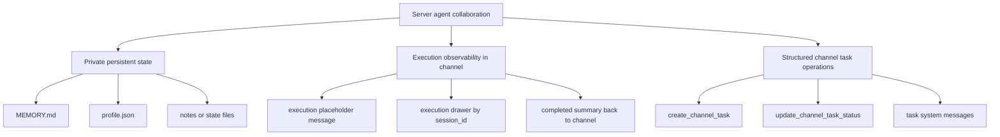

# Server agent 可观测性、task 自主协作与持久状态决策

## 元数据

这份决策记录收敛 server 模块当前最关键的三个问题：agent 持久状态初始化不足、频道内 agent 执行过程不可见，以及 agent 还不能以一等能力自主创建和更新 channel task。

| 字段 | 值 |
| --- | --- |
| **决策日期** | 2026-05-06 |
| **关联 spec** | `10-agent-persistent-state-runtime-plan.md`、`11-chat-first-channel-conversation-plan.md`、`12-server-conversation-follow-up-plan.md`、`14-channel-shared-context-and-published-artifacts-plan.md`、`09-channel-task-collaboration-plan.md` |

## 决策摘要

这次决策要解决的是：频道里的 agent 虽然已经能被 mention 触发，但 persistent files 还是空壳，运行过程只在完成后才回写一条终态消息，task 也仍然主要依赖用户显式创建。最终决定是：第一，agent 持久状态必须从“空目录壳子”升级为非空、带契约的 bootstrap；第二，server conversation 必须从“终态镜像”升级为“占位执行消息 + 右侧 execution drawer”的可观测模型；第三，agent 操作 channel task 必须走一等结构化工具或后端专用接口，而不是依赖自然语言 callback 推断。这个决策主要影响 agent 初始化链路、server channel message 模型、右侧抽屉结构、task service 接入方式，以及 persistent runtime 的提示词组装。

## 背景

Poco 现在已经具备 `server / channel / direct message / task / agent` 的 chat-first 协作地基。人类用户可以在频道中发消息、开 thread、手动创建 task；agent 也可以在 persistent runtime 下被 mention 触发，并通过 callback 把 session 内部消息、tool executions、workspace export 等信息持续回传到 backend。

但 server 模块当前存在三个明显断层。第一，持久状态目录虽然存在，但 `MEMORY.md` 和 `profile.json` 目前只是空文件，私有 `artifacts/` 也没有稳定写入路径，导致 UI 中的 `Persistent files` 看起来像已经建模完成，实际却只是空壳。第二，频道内 mention 触发后的可见性仍然过弱。executor 会持续上报 `RUNNING + new_message + state_patch`，但 server conversation 只在 callback `COMPLETED` 时把 assistant 终态结果镜像回频道消息流，所以用户只能看到“开始工作了”和“最后完成了”，中间的 thinking、tool call、todo 进度和当前步骤都不可见。第三，channel task 已经有独立后端模型和 API，但这些能力仍主要面向用户操作，agent 还没有一条结构化、自主的 task 创建与状态更新通路。

如果不把这三个问题一起收口，server 协作面会在三个方向同时失真。持久状态会持续给人一种“已经支持长期记忆”的错觉，但实际上没有稳定入口；频道协作会停留在“终态结果墙”，无法承载真正的 agent 执行观察；task 则会继续停留在“用户把对话转成 task”，而不是“agent 也是 task 协作者”。这三个问题实际上指向同一个核心目标：让 server agent 不只是会被触发，而是成为一个可观察、可持续、可参与 task 流转的一等协作成员。

## 用户叙事

下面这段用户叙事描述的是这次决策落地后的预期体验，覆盖持久状态、执行可观测性和 task 协作三条主线。

**Alice 在 `#backend` 频道里和 `@backend-specialist` 协作处理一个 API 设计任务。**

1. Alice 创建 `@backend-specialist` 后，系统会立即初始化一份非空的持久状态骨架。她在 server 的 colleague profile 中打开持久文件，不再看到空白的 `MEMORY.md` 和空白 `profile.json`，而是一套带默认内容和最小契约的 private state。
2. Alice 在频道里 `@backend-specialist review the retry design`。消息发送后，频道里立刻出现一条 execution placeholder message，表示这个 agent 已经开始处理当前 thread。
3. 这条占位消息在频道消息流中保持紧凑显示，例如展示当前步骤、todo 进度、最近一次工具调用摘要。它不会把大量中间内容直接刷进主消息流。
4. Alice 点击这条 execution item，右侧第四抽屉切换为 execution drawer。这个抽屉以普通 chat execution 的方式展示该 session 的内部消息、thinking、tool call、todo、workspace 变化和 computer 记录。
5. agent 在 persistent runtime 中发现这个问题应该形成工作项，于是它通过结构化 task 能力直接创建一个 channel task，并把 task root thread 和当前会话上下文关联起来，而不是要求用户手动再点一次 `As Task`。
6. 在后续执行中，agent 可以把 task 从 `todo` 移到 `in_progress`，完成自检后再移到 `in_review`。这些状态变化通过 channel task service 产生结构化 system message，并在 task thread 中可追溯。
7. 任务完成后，agent 把真正需要共享的方案文档写入 workspace export，经由 channel published artifacts 进入共享成果树；同时只把长期偏好、稳定约束和结构化运行状态写回自己的 private persistent state。共享成果和私有长期状态仍然保持分离。

## 最终决策

这次决策的核心是：server agent 的“长期存在”不能只依赖 persistent container，“开始工作了”也不能只是一个黑箱状态，而 task 协作不能只停留在用户显式操作。系统要同时补齐持久状态 bootstrap、执行可观测性和 task 自主协作三条能力线。

- **产品决策**：每个 server agent 创建后必须拥有一份非空、可解释的 private persistent state bootstrap，而不是空目录壳子。
- **产品决策**：频道里 mention 触发 agent 后，必须立即生成一条 execution placeholder message，作为该次执行在 server conversation 中的一等可见对象。
- **产品决策**：主频道消息流保持紧凑，执行细节默认进入右侧 execution drawer，而不是把全部中间输出直接刷进频道主消息流。
- **产品决策**：channel task 继续是 channel-native 对象，但不再只允许用户手动创建；agent 也应能创建 task、更新状态、认领或交接 task。
- **UX / UI 决策**：server colleague profile 里的 `Persistent files` 必须明确语义为 agent private state，而不是 shared artifacts。
- **UX / UI 决策**：第四抽屉继续承担共享上下文扩展位，但新增 execution drawer 模式，用来展示单个 agent session 的实时或准实时执行视图。
- **UX / UI 决策**：频道消息流中的 execution item 是 compact 状态卡片，不是完整 execution transcript。点击后才展开到右侧完整视图。
- **技术决策**：`MEMORY.md` 和 `profile.json` 初始化后默认必须非空；`profile.json` 采用系统字段与 agent 可维护字段分区的结构化 schema。
- **技术决策**：persistent-state 维护提示词统一在执行层注入，只在 `agent_runtime_mode=persistent` 时启用；temporary runtime 继续保持 snapshot read-only。
- **技术决策**：server conversation 的可观测性模型从“仅终态镜像”升级为“创建时占位、运行中增量更新、完成时收口”的 message + drawer 双层模型。
- **技术决策**：agent 操作 channel task 必须通过结构化 tool 或内部专用 API 触发 `ServerChannelTaskService`，而不是依赖 callback 文本推断或 skill-creator 式脚本协议。

## 设计约束与不变量

这部分记录后续实现默认不能违背的规则，避免在落地时再次退化回当前的黑箱模式。

- `MEMORY.md` 和 `profile.json` 初始化后默认必须非空。
- `profile.json` 是结构化文件，不能退化成自由格式文本或 agent 任意覆盖的日志文件。
- `profile.json` 的 identity、preset 绑定、runtime policy、权限边界等系统字段必须由系统维护。
- `MEMORY.md`、`notes/`、`state/` 仍然属于 private persistent state，默认不能自动进入频道共享成果树。
- mention 触发后的频道可见性不能继续只依赖 callback 完成态消息镜像。
- 频道主消息流不能直接退化成完整 session transcript；中间执行细节默认进入 execution drawer。
- execution drawer 展示的必须是一个真实 session 的 execution 视图，而不是服务器端手工拼接的伪聊天记录。
- agent 创建或更新 channel task 必须走结构化服务边界，不能通过“让模型输出某种格式文本，再由 callback 猜测意图”来实现。
- channel task 的状态变化仍然必须产出结构化 system message，保证协作可追溯。
- persistent runtime 可以维护长期状态；temporary runtime 继续只能读取 snapshot，不承担长期状态写回责任。

## 技术设计与结构边界

这部分记录会影响实现边界的稳定结构设计，重点覆盖持久状态 bootstrap、server conversation 可观测性链路，以及 agent task 接口边界。

### 数据库表与持久化设计

这次决策不要求立刻新增一大批新表，但要求把已有表的职责收紧，并为 execution observability 留出明确字段边界。

- `agent_persistent_states` 继续作为持久状态元数据主表，现有 `state_root_path`、`profile_path`、`memory_path`、`notes_dir_path`、`state_dir_path`、`artifacts_dir_path` 保留。
- `profile.json` 内部新增 `schema_version` 和受限的 `agent_profile` 子段。系统字段与 agent 可维护字段在 schema 上直接分区。
- `MEMORY.md` 的初始模板建议带 bootstrap marker，用于区分系统种子内容和 agent 后续维护内容。
- `server_channel_messages` 继续作为频道消息主表，但 execution placeholder message 的 `content` 需要稳定承载至少这些字段：
  - `source = "agent_execution"`
  - `session_id`
  - `agent_identity_id`
  - `agent_handle`
  - `trigger_message_id`
  - `thread_root_message_id`
  - `execution_status`
  - `summary`
  - `current_step`
  - `todo_progress`
- 现阶段可以先复用 `server_channel_messages` 的 `system` message 类型承载 execution placeholder；如果后续 execution message 的语义和生命周期明显独立，再单独评估是否拆出专门 execution message 表。

### 核心模型关系

这次决策把 server agent 相关对象收敛成三条稳定主线，而不是分散在多个临时语义里。

- `private persistent state`
  负责长期身份记忆、结构化状态和私有持久输出。
- `server conversation execution item`
  负责在频道消息流中表达“这个 agent session 正在为当前对话工作”。
- `channel task`
  负责结构化工作项和状态流转。

三者之间的关系如下：

- agent 的持久状态不自动变成频道共享成果。
- execution item 只是 session 的频道侧投影，不拥有持久状态。
- channel task 可以由用户或 agent 创建，但其状态变化必须回流到 channel message thread。
- 一个 execution item 可以关联一个 `session_id`，并可选择关联零个或一个 `server_channel_task_id`。

### 关键数据流

这次设计要求把 mention 触发、运行中状态、完成态镜像和 task 协作串成一条完整链路，而不是三段互相脱节的实现。

### 后端实现思路

后端要同时补齐三条能力线：持久状态 bootstrap、server conversation execution item、agent task 操作入口。

- **持久状态 bootstrap**
  - 在 `backend/app/services/agent_identity_service.py` 的 agent 创建链路中，新增显式 bootstrap 调用。
  - 在 `executor_manager/app/services/workspace_manager.py` 中，把当前 `get_agent_state_dir()` 的 `touch` 逻辑升级成 `ensure_agent_state_bootstrap()`。
  - 该方法负责写入非空 `MEMORY.md`、非空 `profile.json`，并可选补 `notes/active-context.md`、`state/task-state.json` 等骨架文件。
  - 对已有 agent 的 backfill 必须是幂等的，不能覆盖非空文件。

- **execution placeholder message**
  - 在 `ServerAgentTriggerService.trigger_for_channel_message()` 成功 enqueue 后，立即创建一条 execution placeholder message，而不是等 callback 完成后才首次出现在频道中。
  - 这条消息需要记录 `session_id`，为右侧 execution drawer 提供稳定入口。
  - 在 `backend/app/services/callback_service.py` 处理 `RUNNING` callback 时，除了现有 session 内部消息持久化，还要更新对应 execution placeholder message 的摘要字段，例如 `current_step`、最近 tool、todo 进度、运行状态。
  - 当前完成态 assistant message 仍可在结束时收口为频道里的结果摘要，但它不应再是频道里第一次也是唯一一次看见这个 session。

- **agent task 操作入口**
  - 不新增“解析模型自由文本再推断 task 意图”的 callback 协议。
  - 增加结构化工具或专用内部 API，例如：
    - `create_channel_task`
    - `update_channel_task_status`
    - `claim_channel_task`
    - `comment_on_channel_task`
  - 这些能力应直接调用 `ServerChannelTaskService`，并从 session `config_snapshot` 读取 `server_id / channel_id / agent_identity_id / thread_root_message_id` 作为默认上下文。
  - task 相关 system message 在 service 层继续统一生成，避免把 task 协作散落到 executor callback 或 prompt 解析逻辑里。

### 执行层与 prompt 注入思路

当前频道 trigger prompt 只负责共享上下文，不足以承担持久状态维护协议和 task 自主协作协议。这两者都应该由执行层统一补充。

- 在 `executor/app/core/engine.py` 中，新增 `build_persistent_state_hint(config)`，仅在 `agent_runtime_mode == "persistent"` 时注入。
- 提示词至少要说明：
  - `/agent_state` 是你的长期私有状态目录；
  - `MEMORY.md` 适合写长期稳定事实、偏好、协作约束；
  - `state/*.json` 适合写结构化当前状态；
  - `profile.json` 的系统字段不可覆盖，只能更新预留 agent 维护区；
  - 不要把临时任务噪音写入长期记忆；
  - 不要把 private state 误当成 shared artifacts。
- 同一层还应补充 task 协作提示，明确告诉 agent：如果当前工作项应该进入 channel task 流，请优先使用结构化 task 能力，而不是只在对话里口头声明“我创建了任务”。
- `temporary runtime` 不注入上述写入型 persistent-state hint，只保留 snapshot read-only 的边界说明。

### 前端对接思路

前端需要同时区分三种右侧语义：shared artifacts、private persistent files、execution drawer。

- `frontend/features/servers/ui/colleague-detail.tsx`
  当前继续承载 owner-only private persistent files 浏览，但文案和心智要稳定指向 `agent private state`。
- `frontend/features/servers/ui/server-conversation-page-client.tsx`
  当前只在初次进入频道时拉一次 messages/tasks/artifacts，发送消息后不会刷新 artifacts，也没有消息级 execution drawer 入口。后续需要：
  - 为 execution placeholder item 增加点击交互；
  - 新增 `drawer.type = "execution"`；
  - 让第四抽屉可切换到 execution drawer，而不是只支持 shared artifacts。
- execution drawer 最好复用现有 chat execution 容器的 session 视图能力，而不是在 server 页面里重新手写一套消息、tool、todo、computer 渲染逻辑。
- shared artifacts drawer 继续只展示 `published artifacts`，不要和 private persistent files 混成同一路口。

### 接口边界

接口层需要把“频道里的执行投影”“私有持久状态”“channel task 操作”这三条边界拆开。

- **私有持久状态**
  owner 继续通过 `server_agents` 相关只读接口浏览。
- **执行投影**
  server conversation 读取 `server_channel_messages`，其中 execution placeholder message 是一类特殊 system payload。
- **完整 execution 详情**
  仍通过既有 session execution 接口按 `session_id` 获取，不在 server conversation API 里重复嵌套完整 session transcript。
- **task 操作**
  agent 通过结构化 tool 或专用内部 API 调用 channel task service；前端用户继续走既有 channel task API。

### 权限、状态与资源边界

这次决策要求把“谁能看什么、谁能写什么、在哪一层写”讲清楚，避免私有状态被误公开，或把 server conversation 变成杂糅的执行日志墙。

- owner 对 private persistent state 保留只读浏览权。
- persistent runtime 对 live `/agent_state` 保留写权限。
- temporary runtime 继续只读 snapshot。
- execution placeholder message 对频道成员可见，但它只公开紧凑摘要，不直接暴露全部 private state。
- 完整 execution drawer 读取的是 session 内部 execution 数据，不是 private persistent files。
- `MEMORY.md`、`notes/`、`state/` 默认不自动进入频道共享 artifacts。
- `artifacts/` 继续可以为空。它不是频道共享成果树，也不是初始化完成度的判断依据。
- agent 对 channel task 的结构化操作权限，必须受 `server_id / channel_id / agent_identity_id` 上下文约束，不能跨频道、跨 server 任意写 task。

## 备选方案简述

这里简要记录看过但没有采用的方案，避免后续重复争论。

- **方案 A：继续保持当前模式，只在 callback 完成时镜像一条终态 assistant message。**
  没选，因为这会让 mention 触发长期处于黑箱状态，用户只能知道开始和结束，不知道中间发生了什么。
- **方案 B：把所有 thinking、tool call 和中间消息直接刷进频道主消息流。**
  没选，因为频道主流会迅速退化成 execution transcript，损害正常多人会话的可读性。
- **方案 C：让 agent 通过自然语言说“请帮我创建一个 task”，再由 callback 或消息解析器猜测意图。**
  没选，因为这会把 task 子域重新做成脆弱的文本协议，既不稳定也难审计。
- **方案 D：只补 `MEMORY.md` 和 `profile.json` bootstrap，不处理另外两个问题。**
  没选，因为这只会修复 private state 空壳，无法解决 server 协作面最明显的黑箱执行和 task 协作缺口。

## 可视化补充

下面这张图概括了三条能力线在 server 模块中的分工。

## 约束与前提

这份决策建立在当前 server / channel / agent / task 基础模型已经存在、persistent runtime 与 temporary snapshot 边界已经成立的前提下。

- 当前系统继续使用 `/agent_state` 作为容器内持久状态挂载路径。
- 当前 `server_channel_messages` 仍是频道消息主表。
- 当前 `ServerChannelTaskService` 已经是 channel task 的主服务边界。
- 当前 `ExecutionContainer` 和 session execution 视图能力已经存在，可以复用为 execution drawer 的内容来源。
- 这份决策不改变 published artifacts 的共享边界。private persistent state 仍然不会自动公开。
- 如果后续决定引入更强的实时通道，例如 websocket 或 SSE，这份决策仍成立；它只规定可观测性产品模型，不强绑底层推送实现。

## 历史变更

这份文档当前是首次记录，用于统一收敛 2026-05-06 讨论中明确提出的三个问题，而不是只单独记录其中一条。

| 日期 | 变更内容 | 原因 |
| --- | --- | --- |
| 2026-05-06 | 初次记录 | 把持久状态、执行可观测性和 agent task 自主协作统一收敛成一份 server agent 决策 |
