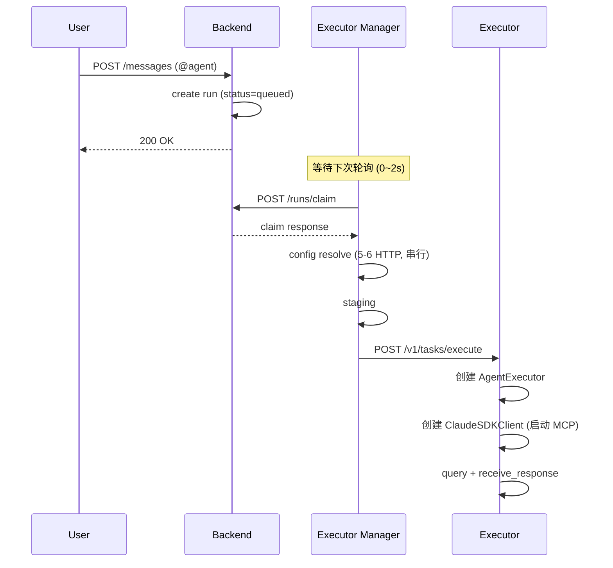
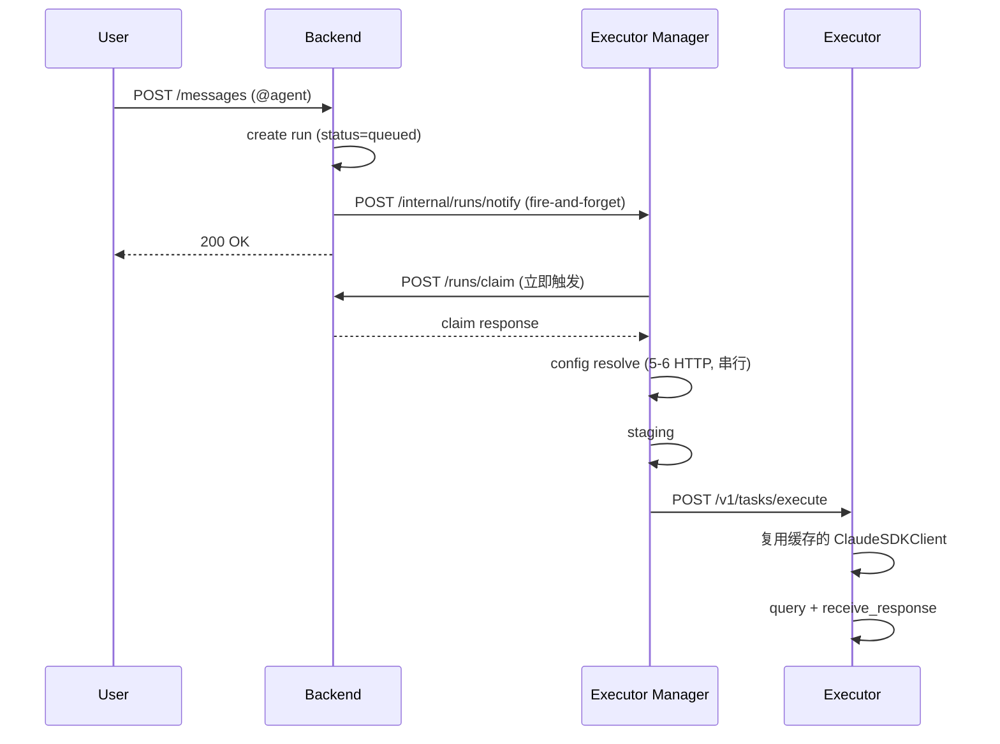

# Agent 调度延迟优化：推送通知与 SDK 缓存

## 元数据

| 字段         | 值                                                                                                                          |
| ------------ | --------------------------------------------------------------------------------------------------------------------------- |
| **决策日期** | 2026-05-07                                                                                                                  |
| **关联 spec** | `18-agent-dispatch-latency-optimization-plan.md`、`10-agent-persistent-state-runtime-plan.md`、`12-server-conversation-follow-up-plan.md`、`2026-05-06-server-agent-observability-tasks-and-persistence.md` |

## 决策摘要

这次决策要解决的问题是：频道中 mention 触发 agent 后，即使用户确认没有排队中的任务、容器也已经在运行，二次响应仍然存在 3-5 秒的感知延迟。根因不在容器冷启动，而在调度链路的两层结构性开销：executor_manager 的 2 秒固定轮询间隔和 executor 内部每次执行都重建 ClaudeSDKClient 的全量初始化。

最终决定采用两个独立优化：第一，在 backend 创建 run 后主动通知 executor_manager 立即拉取，消除轮询等待；第二，在 executor 进程内为持久化 agent 缓存 ClaudeSDKClient 实例，避免每次执行都重启 MCP 子进程。两者改动不同的服务、不同的文件，可以独立实施和验证。

## 背景

Poco 的 server agent 执行链路已经形成了完整闭环：用户在频道发消息 → backend 匹配 agent 并创建 run → executor_manager 通过 APScheduler 每 2 秒轮询 claim → config 解析 → staging → 容器获取 → executor 内部执行。这条链路在功能上是完整的，但在延迟感知上有明显断层。

当前系统已经为频道 agent 配置了 `container_mode="persistent"`。这意味着同一个 agent 的 Docker 容器在首次创建后被持续复用，不再每次触发都经历 docker run + 健康检查的 5-120 秒冷启动。但从用户视角看，"二次响应"仍然慢——mention 一个已经热启动的 agent，从发消息到看到 agent 开始工作，仍然需要等待 3-5 秒。

经代码分析定位，这 3-5 秒的前置延迟主要来自两个阶段。第一，executor_manager 使用 APScheduler 间隔轮询（默认 2 秒）从 backend claim run，这意味着任务入队后平均需要等待 1 秒才能被发现。第二，executor 的 `AgentExecutor` 在每次 `POST /v1/tasks/execute` 时都重新创建，`ClaudeSDKClient` 也在 `async with` 块内创建并销毁，导致每次执行都要重新启动 MCP server 子进程并建立通信通道。

如果不优化这两个阶段，即使后续加入了更丰富的执行可观测性和 task 协作能力，用户对 agent 的响应速度感知仍会停留在"每次 mention 都要等好几秒才开始动"的水平，这在高频协作场景下会显著影响信任感。

## 用户叙事

**Alice 在 `#backend` 频道里和 `@api-specialist` 协作。**

1. Alice 第一次 `@api-specialist` 时，系统创建持久化容器，耗时较长（属于首次冷启动，不在本次优化范围内）。
2. Alice 第二次 `@api-specialist review the error handling`。消息发送后，频道里的 execution placeholder 仍然会立即出现，但它从 `queued` 切到"开始执行"状态的等待时间明显缩短，而不是像之前那样还要再等 2-3 秒才有反应。
3. agent 开始执行后，execution placeholder 的状态和步骤信息更快开始刷新，因为 MCP 工具（如 playwright、memory）不需要重新启动子进程。
4. 连续多次 mention 同一个 agent 时，响应延迟保持稳定且可预测，不会因为每次都重建内部状态而波动。

## 最终决策

这次决策的核心是：持久化容器已经解决了 OS 层面的冷启动，但调度和执行层仍有无状态重建的开销，需要在两个独立层面消除。

- **技术决策**：executor_manager 从纯轮询模式升级为"推送通知 + 轮询兜底"模式。backend 在 run 成功落库并提交后立即向 executor_manager 发送 HTTP 通知，触发立即 poll；APScheduler 轮询仍然保留作为 fallback。
- **技术决策**：executor 为持久化 agent 维护进程级 ClaudeSDKClient 缓存，但缓存实例必须串行使用。优先覆盖“同一 persistent agent / 同一活跃会话”的连续任务复用，跳过 MCP 子进程启动阶段，而不是假设一个 client 可以被多个并发任务任意复用。
- **技术决策**：两个优化独立实施、独立验证，不相互依赖。推送通知改动 backend + executor_manager，SDK 缓存改动 executor，服务边界不交叉。
- **技术决策**：推荐先实施推送通知（改动小、见效快），再实施 SDK 缓存（收益更大但需要更细致的生命周期管理）。

## 设计约束与不变量

- APScheduler 轮询不能被移除，只能被降级为 fallback。推送通知失败时系统仍然能通过轮询兜底正常工作。
- 推送通知必须是 fire-and-forget 的 HTTP 调用，不能因为通知失败而阻塞 run 创建流程。
- executor 的 SDK 缓存必须至少按 persistent runtime 隔离，不同 agent 之间不能共享 client 实例。
- 同一个缓存 client 在任一时刻只能被一个执行持有，不能并发复用。
- 缓存的 SDK client 必须有健康检查和过期淘汰机制，不能无限期持有可能已经损坏的 client。
- 当前优化不能建立在“任意单 client 多 session 并发复用”这一前提上。官方文档确认的是同一 client 的连续 `query()` 会延续同一会话；本地已安装 SDK 的 `ClaudeSDKClient.query(prompt, session_id=...)` 说明它支持显式传入 session 标识，但文档没有把“多 session 多路复用”定义为推荐模型。因此当前实现必须以单 client 排他使用为前提。
- 两个优化都不改变现有的 callback 状态回传链路、execution placeholder 更新逻辑和 task 协作接口。

## 技术设计与结构边界

### 关键数据流

#### 当前链路（优化前）

#### 优化后链路

### 推送通知实现思路

改动范围：backend + executor_manager。

**Backend 侧：**

- 在 backend 现有的 enqueue / trigger 链路完成 run 落库并提交后，新增一个 best-effort 的 executor_manager 通知调用。当前更合理的落点是 `TaskService.enqueue_task()` 返回前的异步边界，或更上层的 async API / trigger 调用方，而不是假设存在一个独立的 `run_service.py`。
- 调用目标：`POST http://{executor_manager_host}/api/v1/internal/runs/notify`，body 包含 `run_id` 和 `schedule_mode`。
- 该调用使用请求边界的 background task、线程池包装或显式 async notifier 实现，不影响 enqueue 响应时间。
- 网络异常或 executor_manager 不可达时静默忽略（轮询兜底）。
- executor_manager 地址从 backend 已存在的 `executor_manager_url` 配置读取。

**Executor Manager 侧：**

- 新增 `POST /api/v1/internal/runs/notify` 端点。
- 收到通知后立即调用 `run_pull_service.poll(schedule_modes=[通知中的 mode])`。
- poll 的逻辑不变（claim → config resolve → staging → dispatch），只是触发时机从"APScheduler 下一次 tick"变成"通知到达时"。
- 端点不需要做认证之外的副作用（不创建 run，不修改状态），只是触发一次 poll。
- 如果 poll 已经在进行中（信号量已满），通知被安全忽略——APScheduler 的下一次 tick 会兜底。

### SDK 缓存实现思路

改动范围：executor。

根据 Claude Code 官方 sessions 文档，`ClaudeSDKClient` 适合单进程内的 multi-turn conversation，同一个 client 上连续调用 `query()` 会自动延续同一会话；本地已安装 SDK 还暴露了 `query(prompt, session_id=...)` 签名。与此同时，SDK 源码明确说明同一个 `ClaudeSDKClient` 不能跨不同 async runtime context 复用。因此这里的缓存设计必须围绕“进程内、单 async context、串行复用”展开，而不是把 client 当作可并发共享的全局连接池。

**缓存层：**

- 在 `executor/app/core/engine.py` 或新增 `executor/app/core/client_pool.py` 中维护一个进程级缓存与租约层。推荐键至少包含 `agent_identity_id`，并允许在需要时细化到 `(agent_identity_id, sdk_session_id)`。
- 缓存 client 的生命周期从 `async with` 方法级提升到进程级。
- 每个 client 在首次使用时创建（启动 MCP 子进程），后续同一 persistent runtime 的连续任务直接复用。

**新任务接入：**

- `POST /v1/tasks/execute` 收到请求后，检查 `agent_identity_id` 是否有缓存 client。
- 如果有且 client 健康，并且当前没有被其他执行持有，直接调用 `client.query(new_prompt, session_id=...)`，跳过 MCP 启动。
- 如果没有或 client 不健康（进程退出、通信断开），重新创建。
- 如果已有 client 仍在执行中，新 run 不能并发复用该 client，而应等待、回退到队列语义，或由更高层保证同一 active session 只有一个 inflight run。

**健康检查与淘汰：**

- 每次使用缓存 client 前做轻量检查（如检查 MCP 子进程是否存活）。
- 设置 TTL 或 LRU 上限，避免长时间不活跃的 client 占用资源。
- 容器被 ContainerPool 回收时，对应的 executor 进程也跟着销毁，client 自然释放，不需要跨进程协调。

**Session 语义：**

- 缓存 client 复用的是本地 MCP 子进程、Claude Code 连接和当前 async context，不是把所有会话状态都外提成一个无状态句柄。
- 对于同一 client 上的连续 query，官方文档确认会自动延续同一会话。
- 当需要显式指定 session 时，应使用 SDK 已提供的 `client.query(..., session_id=...)` 语义，而不是在 `query()` 上假设一个不存在的 `resume` 参数。
- 当前架构最稳妥的落地方式仍然是：优先复用同一 persistent agent 的单活跃会话路径，而不是在第一阶段就把一个 client 设计成多个独立 session 的通用复用器。

### 接口边界

- 推送通知端点 `POST /api/v1/internal/runs/notify` 是 executor_manager 的内部接口，不对外暴露。
- SDK 缓存是 executor 进程内部状态，不暴露任何新接口，不影响 executor_manager 与 executor 之间的通信协议。
- 现有 callback、claim、execute 接口签名和行为均不改变。

### 预期收益

| 场景             | 当前延迟   | 推送通知后 | 推送 + SDK 缓存后 |
| ---------------- | ---------- | ---------- | ----------------- |
| 首次响应（冷启动） | 5-120s     | 不变       | 不变              |
| 二次响应（热容器） | ~3-5s      | ~1.5-3s    | ~0.3-0.8s         |
| 连续对话（同 session） | ~3-5s | ~1.5-3s    | ~0.2-0.6s         |

## 备选方案简述

- **方案 A：只缩短轮询间隔（如从 2s 改为 0.5s）。**
  没选，因为这只是减少平均等待时间，仍然有不可预测的延迟；且更频繁的轮询会增加 backend 负载，尤其在没有任务时产生大量空请求。

- **方案 B：用 WebSocket 或 SSE 替换整个轮询架构。**
  没选，因为改动太大且引入了连接管理、重连、状态同步等复杂度。推送通知 + 轮询兜底的方案能以最小改动获得几乎相同的延迟收益。

- **方案 C：在 executor_manager 内缓存 config resolution 结果，跳过重复的 staging。**
  这个方向有价值但属于独立优化，不在本次决策范围内。后续可以作为第三阶段考虑。

- **方案 D：把 executor 改成长驻进程，SDK client 永不销毁。**
  这个方向与方案 B 有类似风险——长驻 client 的内存泄漏、状态漂移和错误恢复都增加了运维复杂度。SDK 缓存方案通过健康检查和淘汰机制在收益和复杂度之间取得平衡。

## 约束与前提

- executor_manager 的 APScheduler 使用内存 job store，重启后 job 丢失。推送通知不改变这个前提，轮询仍然作为重启后的发现机制。
- Claude Agent SDK 的 session 语义依赖 Claude Code / API 侧维护会话状态，SDK 缓存只复用本地 MCP 子进程与连接，不改变远端 session 生命周期。
- 持久化容器的生命周期由 executor_manager 的 ContainerPool 管理，SDK 缓存的生命周期与 executor 进程一致。当 ContainerPool 销毁容器时，executor 进程随之终止，缓存自然清空。
- 推送通知依赖 backend 能访问 executor_manager 的网络地址。如果 executor_manager 部署在 NAT 后面或网络不通，通知会失败并回退到轮询模式。
- 这份决策建立在当前 session queue 仍然保证同一 `AgentSession` 不会并发执行多个 blocking run 的前提上；如果未来要支持同 agent 多线程并行，就需要重新审视 client cache 的 key 和租约模型。

## 历史变更

| 日期       | 变更内容 | 原因         |
| ---------- | -------- | ------------ |
| 2026-05-07 | 初次记录 | 调研 agent 二次响应延迟根因后达成共识 |
