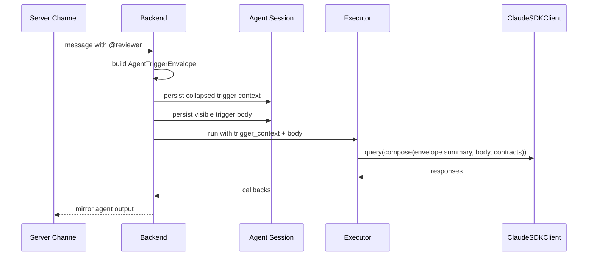
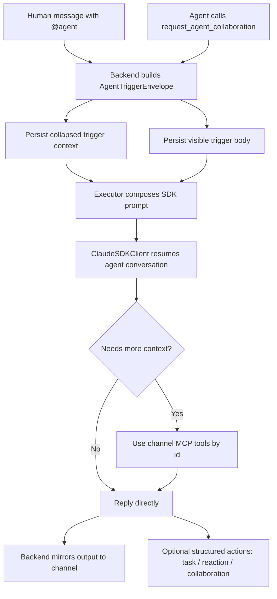

# 持久化 Agent 消息传递与频道 Tool 注入

## 元数据

| 字段 | 值 |
| --- | --- |
| **决策日期** | 2026-05-08 |
| **关联 spec** | `2026-05-04-server-channel-agent-persistence.md`、`2026-05-05-channel-shared-context-and-artifacts.md`、`2026-05-06-server-agent-observability-tasks-and-persistence.md`、`2026-05-07-agent-dispatch-latency-optimization.md`、`20-channel-message-reactions-plan.md`、`22-persistent-agent-trigger-envelope-plan.md`、`23-unified-channel-runtime-tools-plan.md` |

## 决策摘要

当前频道触发持久化 agent 的方式过于粗糙：backend 把触发消息、频道成员、最近消息和部分 artifacts 预览拼成一个大 prompt，再作为单条 user message 发送给 SDK。这让用户回看 agent session 时难以分辨“用户真正说了什么”和“系统附带了什么上下文”，也让 agent 只能被动接受一次性内联上下文，而不是按需读取。

最终决定把持久化 agent 的频道触发输入改为“触发信封 + 触发正文”的两层模型。触发信封是结构化、默认收缩展示的隐式上下文索引，包含 server/channel/message/thread/agent/run 等 id 和有限摘要；触发正文才是用户或上游 agent 真正发送的自然语言内容。agent 可以通过 channel-scoped MCP tools 按 id 读取消息、线程、共享文件、任务和 reaction 状态，形成渐进式披露的上下文获取方式。

## 背景

Poco 现在已经支持 server channel 中通过 `@agent` 或 agent DM 触发持久化 agent。触发链路位于 `ServerAgentTriggerService.trigger_for_channel_message()`：它先匹配目标 agent，再调用 `ChannelSharedContextService.build_message_trigger_prompt()` 构造 prompt，最后通过 `TaskService.enqueue_task()` 写入 agent session/run 并交给 executor 执行。

当前 prompt 构造方式把多类信息混在一起：触发消息正文、频道 id、thread root id、频道人类成员、频道 agent、行为规则、最近 8 条消息、最多 6 个 published artifacts 预览，以及共享文件读取规则。这种方式功能上能跑通，但有三个明显问题。

第一，消息语义不清。agent session 中看到的是一整段系统拼接文本，用户无法自然地区分触发正文和系统注入的上下文。第二，上下文获取不可控。系统一次性内联最近消息和 artifact preview，既可能截断重要内容，也可能把无关内容塞进模型上下文。第三，后续引入 agent-to-agent handoff、message reaction、task 协作后，如果继续把所有语义塞进 prompt，会让触发协议越来越难审计、难测试、难演进。

Claude Agent SDK 的 session 语义支持这次改造。官方 Python SDK 文档区分了 `query()` 与 `ClaudeSDKClient`：`query()` 每次创建新 session，而 `ClaudeSDKClient` 用于连续对话并在同一会话中保留上下文；官方 sessions 文档也说明 `resume` 可以恢复历史会话上下文。Poco 当前 executor 已经使用 `ClaudeSDKClient`、`ClaudeAgentOptions.resume=sdk_session_id` 和 `client.query(..., session_id=...)`，因此持久化 agent 的“连续对话”假设方向成立。

但这不意味着 Poco 可以把频道上下文完全交给 SDK 记忆。SDK session 保存的是 agent 对话历史，不是 server channel 的权威状态；频道消息、thread、artifact、task、reaction 和权限仍然必须以 backend 数据库为准。正确边界是：SDK session 负责延续 agent 自己的对话上下文，Poco 负责给每次触发提供结构化索引和可按需读取的 runtime tools。

## 用户叙事

**Alice 在 `#backend` 频道里触发 `@reviewer`。**

1. Alice 发送：“`@reviewer 看一下这段 API 错误处理有没有问题`”。
2. 频道里只显示 Alice 的原始消息，以及 `@reviewer` 的 execution placeholder。
3. Alice 点进 agent session 时，看到这次 run 的输入被分成两块：上方是一条默认收缩的“Channel trigger context”，包含 channel、message、thread、server、agent、run 等索引；下方是 Alice 的原始触发正文。
4. `@reviewer` 如果只需要当前消息，就直接回复；如果需要前文或共享文件，则调用 `read_channel_messages` / `read_channel_artifact` 等 tool 自主读取。

**Reviewer 需要邀请 `@api` 补充。**

1. Reviewer 在自己的频道输出里自然说明：“我先给出错误处理结论，认证链路建议请 `@api` 补充。”
2. Reviewer 同时调用 `request_agent_collaboration`，结构化指定目标 agent、请求文本、触发来源和引用 id。
3. backend 只根据 tool 调用触发 `@api`，不会因为普通文本里的 `@api` 自动触发，避免循环和误触发。
4. `@api` 的 agent session 同样显示一条默认收缩的 handoff trigger context，以及 Reviewer 写给它的请求正文。

**Bob 对 Reviewer 的回复贴 reaction。**

1. Bob 在频道消息上点击 `👍`。
2. reaction 作为独立消息互动落库并在消息列表聚合展示。
3. agent 如果需要表达轻量反馈，也通过 `add_channel_message_reaction` tool 操作当前频道消息。
4. reaction 不作为 agent 触发源，也不改变原消息正文。

## 最终决策

持久化 agent 的频道触发协议采用“结构化触发信封 + 可见触发正文 + 按需读取 tools”的模型。

- **产品决策**：用户或 agent 的自然语言输出仍然是频道中的主要协作界面。`@handle` 在人类消息中可以触发 agent；agent 输出里的 `@handle` 只表示可见提及，不自动触发另一个 agent。agent-to-agent 协作必须通过显式 tool 触发。
- **UX / UI 决策**：agent session 中的触发输入分为两部分。触发信封默认收缩，展示在触发正文上方；触发正文按普通 user message 显示。展开触发信封时，用户可以看到 server/channel/message/thread/run/agent 等索引和有限摘要。
- **技术决策**：backend 不再把完整 recent context 和 artifacts preview 作为长期方向继续塞进一个大 prompt。第一阶段可以继续兼容旧 prompt，但新协议的目标是把上下文内联降到最小，把可读取对象交给 channel-scoped MCP tools。
- **技术决策**：Claude Agent SDK session 被视为 agent 对话连续性的载体，但不是频道状态的 source of truth。每次触发都必须携带结构化触发信封，tools 通过 `session_id` 解析 server/channel/agent scope 并从 backend 读取权威状态。
- **技术决策**：内置 channel MCP tools 按领域组织，但运行时注入应收敛到一个 `ChannelRuntimeClient` 和一个内置 channel runtime MCP server。共享文件继续保留 list/search/read 三个 tool；agent 协作只新增一个统一 handoff/collaboration tool；message reaction 按独立 draft 提供 add/remove tool。

## 设计约束与不变量

- 触发信封是一等运行时对象，不是 prompt 文本里的临时段落。
- 触发正文必须保持用户或上游 agent 的原始语义，不应被系统索引、行为规则和 artifacts preview 混写。
- agent session UI 必须能区分并折叠系统触发信封，不能继续把完整 composed prompt 当成唯一可见输入。
- SDK session 可以延续 agent 历史对话，但不能替代每次触发的结构化索引。
- backend 数据库中的频道消息、thread、artifact、task、reaction 和 agent membership 是 runtime tools 的权威来源。
- agent 输出里的 `@handle` 不自动触发 agent。只有人类频道消息 mention、agent DM、或显式 collaboration tool 调用可以触发持久化 agent。
- collaboration tool 只表达路由和触发，不承载复杂业务语义。agent 想请另一个 agent 输出什么，应在自己的可见频道输出中自然说明，并在 tool 参数中放最小请求文本和引用 id。
- reaction 不作为触发源；reaction 是轻量互动关系，不是消息调度事件。
- channel-scoped tools 不接受 server/channel/agent 身份参数；这些身份必须从当前 `session_id` 的 config snapshot 和 runtime scope 解析。
- 新增 channel-scoped tools 必须优先挂到同一个 channel runtime client / MCP server 中一起注入，避免 executor 里继续增长多个彼此独立的 `__poco_channel_*` server。
- 既有 `channel_tasks`、`channel_artifacts` 分散实现可以在迁移期兼容，但目标结构是单一 `__poco_channel_runtime`，由内部子模块按 artifacts、messages、agents、collaboration、tasks、reactions 分区实现。
- 任何 tool 成功前，agent 都不能声称已经读取文件、创建任务、贴 reaction 或触发另一个 agent。

## 技术设计与结构边界

### Agent SDK Session 语义

Poco 应明确区分三类状态：

| 状态类型 | 存放位置 | 用途 | 是否权威 |
| --- | --- | --- | --- |
| SDK conversation session | Claude Agent SDK / Claude Code session，Poco 保存 `sdk_session_id` | 让同一 persistent agent 延续多轮对话 | 对 agent 对话历史权威，不对频道状态权威 |
| Agent private state | 持久化容器 `/agent_state` | agent 长期记忆、偏好、工作笔记 | 对 agent 私有记忆权威 |
| Channel shared state | backend DB + object storage | 频道消息、thread、artifact、task、reaction、membership | 对频道协作状态权威 |

当前 executor 路径已经符合第一类状态的基础要求：`AgentExecutor` 使用 `ClaudeSDKClient`，并在 options 中设置 `resume=self.sdk_session_id`；callback hook 会从 SDK 的 init/result message 中捕获 `sdk_session_id` 并回传 backend。后续实现应继续依赖这条链路恢复 agent 对话，但每次触发仍要构造新的 trigger envelope。

### 触发信封模型

建议定义稳定的 `AgentTriggerEnvelope` JSON 对象，可放在 `agent_runs.config_snapshot.trigger_context`、`agent_messages.content.metadata.trigger_context` 或等价 JSON 字段中。第一版不一定需要新表，但必须让它从 composed prompt 中独立出来。

核心字段：

```json
{
  "version": 1,
  "trigger_type": "channel_mention",
  "server_id": "00000000-0000-0000-0000-000000000000",
  "channel_id": "00000000-0000-0000-0000-000000000000",
  "trigger_message_id": "00000000-0000-0000-0000-000000000000",
  "thread_root_message_id": "00000000-0000-0000-0000-000000000000",
  "target_agent_identity_id": "00000000-0000-0000-0000-000000000000",
  "target_agent_handle": "reviewer",
  "source_actor": {
    "actor_type": "user",
    "user_id": "user_123",
    "display_name": "Alice"
  },
  "references": {
    "message_ids": ["00000000-0000-0000-0000-000000000000"],
    "artifact_ids": [],
    "task_ids": []
  },
  "handoff": {
    "parent_run_id": null,
    "depth": 0,
    "dedupe_key": "channel-trigger:<message_id>:<agent_id>"
  }
}
```

`trigger_type` 的第一版取值：

- `channel_mention`：人类在普通频道消息中显式 `@agent`
- `agent_dm`：人类在 agent DM 中发送消息
- `agent_collaboration`：上游 agent 通过 collaboration tool 显式触发
- `scheduled_channel_task`：未来由频道任务或定时任务触发，当前只预留语义

### Agent Session 中的两层消息显示

agent session 的用户输入渲染应拆成：

1. **隐式触发信封**：默认收缩，位于触发正文上方。折叠态只显示来源、channel、trigger type、message id 和少量状态；展开态显示完整 envelope JSON 的人类可读视图。
2. **触发正文**：普通 user message，显示用户或上游 agent 真正发出的自然语言请求。

底层发送给 SDK 时可以先保持兼容：由 executor 把 envelope 摘要、trigger body 和必要 contract 组合成 prompt。重要变化是持久化和 UI 不再只有一个大 prompt 字符串，而是保留结构化边界。



### 渐进式上下文披露

后续 prompt contract 应从“内联完整上下文”改成“提供索引和读取方式”：

- 当前触发正文必须直接给 agent。
- 当前触发消息的 id、thread root id、channel id、server id 必须在 envelope 中给 agent。
- recent messages 可以只给轻量索引，如 id、作者、时间和短 preview；完整内容通过 tool 读取。
- artifacts 默认只给 id、logical_path、display_name、mime_type、size；正文通过 `read_channel_artifact` 读取。
- task 和 reaction 状态默认不内联，除非触发本身来自相关对象；需要时通过对应 tool 读取或操作。

这让 agent 自主决定是否查看前文、thread、共享文件或任务，而不是让 backend 每次都猜测应该塞多少上下文。

### Tool 注入体系

内置 channel MCP server 继续只在 `server_id && channel_id && agent_identity_id` 都存在时注入。结构上应收敛为：

- executor 只注入一个 built-in MCP server：`__poco_channel_runtime`
- executor 只持有一个 channel runtime facade：`ChannelRuntimeClient`
- `ChannelRuntimeClient` 内部可以按资源域组合多个小客户端，例如 artifact、message、agent directory、collaboration、task、reaction
- executor-manager 可以保留多个代理路由，也可以提供统一 `/api/v1/agent-channel-runtime/*` 前缀；关键是不让 executor 的 MCP 注入层继续分散
- backend internal API 仍按 service 边界拆分，避免一个大 service 同时承担消息读取、task、reaction 和 handoff 的业务逻辑

推荐 tool surface 如下。

| 领域 | 当前/新增 | Tool | 说明 |
| --- | --- | --- | --- |
| 共享文件 | 当前保留 | `list_channel_artifacts` | 列出当前频道 published artifacts |
| 共享文件 | 当前保留 | `search_channel_artifacts` | 按名称、logical path、来源或文本搜索 |
| 共享文件 | 当前保留 | `read_channel_artifact` | 按 `artifact_id` 或 `logical_path` 读取内容 |
| 频道消息 | 当前实现 | `read_channel_messages` | 按 `message_ids` 精确读、按 `thread_root_message_id` 读 thread、按 `anchor_message_id + direction` 翻阅频道 timeline、或用 `read_all` 显式读取当前频道全部消息 |
| 频道消息 | 延后可选 | `search_channel_messages` | 当轻量索引不足以发现历史消息时再加 |
| 频道成员 | 新增建议 | `list_channel_agents` | 返回当前频道可协作 agent 的 handle/id/display name |
| Agent 协作 | 新增建议 | `request_agent_collaboration` | 显式触发另一个 agent，参数保持路由与最小请求语义 |
| 频道任务 | 当前保留 | `create_channel_task` | 创建 team-visible task |
| 频道任务 | 当前保留 | `claim_channel_task` | 当前 agent 认领 task |
| 频道任务 | 当前保留 | `update_channel_task_status` | 更新 task 状态 |
| 频道任务 | 当前保留 | `comment_on_channel_task` | 在 task thread 写进展 |
| 消息互动 | 来自 reaction draft | `add_channel_message_reaction` | 对当前频道消息贴 emoji reaction |
| 消息互动 | 来自 reaction draft | `remove_channel_message_reaction` | 撤销当前 agent 的 reaction |

这个表描述的是 agent 看到的工具能力，不要求每个领域单独创建一个 MCP server。第一版实现时，新增 message / collaboration / reaction tools 应直接进入统一 channel runtime MCP server；现有 artifacts / tasks 可以在同一阶段迁移，或先通过 facade 包装旧 client，后续再删除旧注入入口。

#### `read_channel_messages` 当前契约

`read_channel_messages` 是频道消息读取的统一入口，不再只表示“读取 thread”。它必须同时覆盖精确读取、thread 读取、频道 timeline 翻页和显式全量读取，避免 agent 因为只拿到当前 thread 而误判频道上下文。

当前输入字段：

```json
{
  "message_ids": ["00000000-0000-0000-0000-000000000000"],
  "thread_root_message_id": "00000000-0000-0000-0000-000000000000",
  "anchor_message_id": "00000000-0000-0000-0000-000000000000",
  "direction": "before",
  "include_anchor": true,
  "read_all": false,
  "limit": 50
}
```

读取规则：

- `message_ids` 用于精确读取一个或多个已知消息。executor 兼容单个字符串输入，但规范层面仍建议传数组。
- `thread_root_message_id` 用于读取指定 thread 的 root message 和 replies。如果传入的是 reply id，backend 会解析到对应 root。
- `anchor_message_id + direction` 用于从某条消息开始向前或向后翻阅当前频道 timeline。`direction = before` 读取更旧消息，`direction = after` 读取更新消息；`include_anchor` 控制返回结果是否包含锚点消息。
- 无 selector 时返回当前频道最近一页顶层消息，用于 agent 主动发现近期上下文。
- `read_all = true` 只能作为显式选择使用，表示读取当前频道全部消息行，包括 thread replies。默认调用不能隐式全量读取，避免把大量历史误塞进上下文。
- `limit` 默认 50，常规读取会被服务端限制在安全上限内。`read_all = true` 且无其他 selector 时不使用分页上限。

当前实现限制：

- `anchor_message_id + direction` 目前按频道顶层 timeline 翻页，不把 thread replies 混入同一条线性 timeline。如果后续产品要求“任意消息都能按全频道消息流前后翻”，需要扩展 repository 查询语义。
- `read_all = true` 面向调试、复盘和小频道上下文恢复。常规 agent 协作应优先使用 `message_ids`、`thread_root_message_id` 或 anchor 翻页。
- `read_channel_messages` 会返回 reaction 聚合和 reply count，因此不需要单独的 reaction 读取 tool。

`request_agent_collaboration` 建议参数：

```json
{
  "agent_handle": "api",
  "request_text": "Please review the authentication-specific part of this answer.",
  "reason": "The current agent is not the owner of auth flow details.",
  "thread_root_message_id": "00000000-0000-0000-0000-000000000000",
  "reference_message_ids": ["00000000-0000-0000-0000-000000000000"],
  "reference_artifact_ids": [],
  "mode": "consult"
}
```

`mode` 第一版只需要 `consult` 与 `handoff`。不要继续拆成 `ask_for_review`、`ask_for_summary`、`delegate_fix` 等语义 tool；这些细节应出现在 agent 的可见输出和 `request_text` 中。

### 触发与防循环边界

agent-to-agent 触发必须具备以下约束：

- 使用 `dedupe_key` 防止同一来源重复触发同一 agent。
- 使用 `depth` 或 `hop_count` 限制链式 handoff，第一版建议最大 2。
- 禁止目标 agent 等于当前 agent。
- 如果目标 agent 不在当前 channel 或 lifecycle 非 active，tool 返回错误，不创建 run。
- agent 普通消息中的 `@handle` 不进入 `ServerAgentTriggerService._collect_target_agents()` 的触发路径。
- backend 为 collaboration trigger 创建 execution placeholder，并在 trigger envelope 中记录 parent run/message。

### 与 Reaction 方案的整合

`20-channel-message-reactions-plan.md` 中的 reaction 设计继续成立，但需要纳入统一 tool 注入心智：

- reaction 是 `message x emoji x actor` 的独立关系。
- 人类 reaction 走公开 API。
- agent reaction 走 channel-scoped MCP tools。
- reaction tool 与 collaboration tool 同级，都是结构化动作；但 reaction 不会触发 agent，也不会改变消息正文。
- reaction 聚合信息可以被 `read_channel_messages` 返回，避免 agent 为理解消息状态再调用单独 reaction 读取 tool。

### 与现有 Task / Artifact Tool 的整合

当前 artifact tool 不需要继续细化。`list/search/read` 已经覆盖共享文件的发现与读取，且边界清晰：它只读 published artifacts，不读 `/workspace`、`/agent_state` 或 unpublished session files。

当前 task tool 也保持为结构化团队任务操作面。它不应替代 agent 自己的 `TodoWrite`，也不应被用来表达短暂思考过程。agent 只有在某项工作需要变成频道可见协作任务时，才创建或更新 channel task。

## 备选方案简述

- **方案 A：继续拼一个大 prompt。**
  不采用。它实现成本低，但会持续制造截断、回看不清和上下文不可控问题。

- **方案 B：完全依赖 SDK session 记忆，不再传频道索引。**
  不采用。SDK session 不是频道数据库，不能保证知道最新消息、权限、artifact 或 task 状态。

- **方案 C：agent 输出中的 `@handle` 自动触发另一个 agent。**
  不采用。普通提及和真实触发无法可靠区分，容易产生循环、误触发和审计困难。

- **方案 D：为每种 agent 协作语义单独设计 tool。**
  不采用。第一版只保留统一 collaboration tool，复杂语义放在可见消息和 `request_text`，避免 tool surface 膨胀。

## 可视化补充



## 约束与前提

- 这份决策依赖当前 persistent agent 仍然以单 active session 为主。如果未来同一 agent 支持多频道并行长会话，需要重新审视 `sdk_session_id`、client cache key 和 trigger envelope 中的 thread/session 关系。
- 当前 `AgentMessage.content` 是 JSON，可在不立即新建表的情况下承载 `trigger_context`。如果后续查询和审计需要更强约束，再考虑独立 `agent_run_triggers` 表。
- 触发信封默认收缩展示是 UX 约束，不代表它对 agent 不可见。agent 应看到必要索引，但不应被迫看到所有历史正文。
- 官方 SDK 文档支持 session resume 和 `ClaudeSDKClient` 连续对话语义，但 Poco 仍需保存 `sdk_session_id` 并处理恢复失败、session 失效和 client 重建。

## 参考资料

- [Claude Docs: Session Management](https://docs.claude.com/en/api/agent-sdk/sessions)
- [Claude Docs: Agent SDK reference - Python](https://docs.claude.com/en/api/agent-sdk/python)

## 历史变更

| 日期 | 变更内容 | 原因 |
| --- | --- | --- |
| 2026-05-08 | 初次记录 | 固化持久化 agent 频道触发、消息显示与 channel tool 注入体系 |
| 2026-05-08 | 补充单一 `ChannelRuntimeClient` / `__poco_channel_runtime` 注入约束 | 避免新增频道 tool 继续分散到多个 MCP server |
| 2026-05-10 | 补充 `read_channel_messages` timeline 翻页与显式全量读取契约 | 防止消息读取 tool 语义漂移成只能读取 thread |
